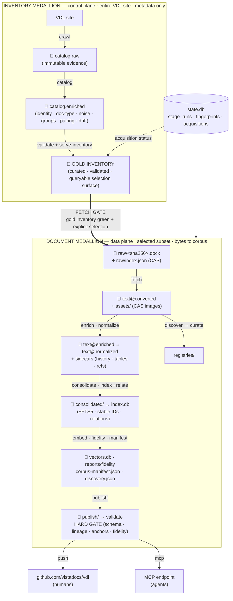

# vdocs — Pipeline Design Document

**Status:** Founding design (greenfield rewrite). **Date:** 2026-06-01.
**Supersedes:** the v1 implementation in this repo (kept for *reference only* — see §16).
**Audience:** the implementer(s) of the new repo, and any third-party author who must
understand the whole system from cold.

**Naming convention:** the project, git repository, Python import package, and CLI are all
**`vdocs`** (repo `vdocs`, `import vdocs`, `vdocs <command>`). This is the v2 rewrite that
replaces the legacy **`vista-docs`** codebase; the short unified name keeps repo, package,
and command identical so there is nothing to drift. (The published *corpus* repo
[`vistadocs/vdl`] and the separate downstream API repo are unaffected by this rename.)

This document is the single source of architectural truth for the rewrite. It is written
to be read top-to-bottom by someone who has never seen the project. Every non-obvious
choice is an explicit decision with rationale (the ADR tables in §10). If the code and
this document disagree, the document is the bug report.

**Companion specs.** Two documents specify a layer in full and are subordinate-but-authoritative
for it: **[`vdl-crawl-spec.md`](vdl-crawl-spec.md)** — the crawl→**enriched-inventory** layer (`crawl` +
`catalog`), a *foundational layer* that must be built and validated **green before any document is
fetched** (it is the gate on `fetch`, §8); and **[`fidelity-framework.md`](fidelity-framework.md)** — the
per-document QA verdict that gates `publish`/`push`. Both are bounded by, and consistent with, this design.

---

## Contents

- [1. Purpose and scope](#1-purpose-and-scope)
- [2. Design tenets](#2-design-tenets)
- [3. What we are deliberately not repeating from v1](#3-what-we-are-deliberately-not-repeating-from-v1)
- [4. Architecture at a glance — the medallion model](#4-architecture-at-a-glance--the-medallion-model)
- [5. Storage model](#5-storage-model)
  - [5.1 Two storage classes (the foundational split)](#51-two-storage-classes-the-foundational-split)
  - [5.2 The content bundle (per-document unit)](#52-the-content-bundle-per-document-unit)
  - [5.3 Layer → directory map](#53-layer--directory-map)
  - [5.4 Why not shred the source into component files (DITA/S1000D)?](#54-why-not-shred-the-source-into-component-files-ditas1000d)
  - [5.5 The derived stores (no naming collisions)](#55-the-derived-stores-no-naming-collisions)
  - [5.6 The fetch selection surface (deciding *what* to download)](#56-the-fetch-selection-surface-deciding-what-to-download)
- [6. Content model and document decomposition](#6-content-model-and-document-decomposition)
  - [6.1 The governing rule](#61-the-governing-rule)
  - [6.2 Whole file as source; every machine view derived from it](#62-whole-file-as-source-every-machine-view-derived-from-it)
  - [6.3 Frontmatter is split by lifecycle (not "sidecar vs baked-in")](#63-frontmatter-is-split-by-lifecycle-not-sidecar-vs-baked-in)
  - [6.4 The decomposition decisions (the candidate table — all adopted)](#64-the-decomposition-decisions-the-candidate-table--all-adopted)
  - [6.5 The "don't over-decompose" guardrail](#65-the-dont-over-decompose-guardrail)
  - [6.6 Version lineage: one anchor document, patch history captured for later git replay](#66-version-lineage-one-anchor-document-patch-history-captured-for-later-git-replay)
  - [6.7 Table of contents — derived navigation with validated round-trip](#67-table-of-contents--derived-navigation-with-validated-round-trip)
- [7. The stage contract (orchestration core)](#7-the-stage-contract-orchestration-core)
  - [7.1 The two core types](#71-the-two-core-types)
  - [7.2 The completion record (the "done" signal)](#72-the-completion-record-the-done-signal)
  - [7.3 Preflight / postflight algorithms](#73-preflight--postflight-algorithms)
  - [7.4 Atomicity and idempotency](#74-atomicity-and-idempotency)
  - [7.5 The orchestrator](#75-the-orchestrator)
  - [7.6 Scheduled & incremental runs (corpus currency)](#76-scheduled--incremental-runs-corpus-currency)
- [8. The pipeline — stages and contracts](#8-the-pipeline--stages-and-contracts)
- [9. Cross-cutting concerns](#9-cross-cutting-concerns)
  - [9.1 Typed configuration](#91-typed-configuration)
  - [9.2 The shared kernel (anti-duplication — tenet #4)](#92-the-shared-kernel-anti-duplication--tenet-4)
  - [9.3 Validation and schema gates](#93-validation-and-schema-gates)
  - [9.4 Lineage and provenance](#94-lineage-and-provenance)
  - [9.5 Observability and failure](#95-observability-and-failure)
  - [9.6 Discovery, the pattern registries, and the adaptive loop](#96-discovery-the-pattern-registries-and-the-adaptive-loop)
  - [9.7 Registry index (canonical catalog)](#97-registry-index-canonical-catalog)
  - [9.8 Templates as computable structural schemas (validation oracle + compliance QC)](#98-templates-as-computable-structural-schemas-validation-oracle--compliance-qc)
- [10. Tooling decisions (ADRs)](#10-tooling-decisions-adrs)
- [11. Repository and package layout](#11-repository-and-package-layout)
- [12. Testing strategy](#12-testing-strategy)
- [13. Delivery — docs-as-code to GitHub](#13-delivery--docs-as-code-to-github)
- [14. Delivery — the machine interface (MCP & semantic search)](#14-delivery--the-machine-interface-mcp--semantic-search)
  - [14.1 What "structured, computable, semantic" means here](#141-what-structured-computable-semantic-means-here)
  - [14.2 Hybrid ranking](#142-hybrid-ranking)
  - [14.3 MCP surface](#143-mcp-surface)
  - [14.4 Discovery descriptor (maximal discoverability)](#144-discovery-descriptor-maximal-discoverability)
  - [14.5 Boundaries](#145-boundaries)
  - [14.6 Search-corpus design — what is indexed, and why it maximizes retrieval fidelity](#146-search-corpus-design--what-is-indexed-and-why-it-maximizes-retrieval-fidelity)
- [15. The downstream API (separate repo, for context)](#15-the-downstream-api-separate-repo-for-context)
- [16. Reuse from the v1 repo (reference-only)](#16-reuse-from-the-v1-repo-reference-only)
- [17. Phased build plan](#17-phased-build-plan)
- [18. Glossary](#18-glossary)

---

## 1. Purpose and scope

`vdocs` turns the **VA VistA Document Library (VDL)** — a sprawling website of
technical manuals — into two co-equal deliverables:

1. a **clean, human-browsable markdown corpus published on GitHub** (docs-as-code), and
2. a **maximally machine-discoverable knowledge base** exposed through an **MCP server**
   that provides **structured, computable, semantic search** across the entire corpus.

It is an **ETL/document-modernization pipeline**: acquire → conform → curate → **serve**.

**Scope: DOCX only.** The VDL publishes most manuals as both DOCX and PDF; `vdocs` ingests the
**DOCX** representation exclusively — DOCX is the richer, structure-preserving source and the only
format the pipeline converts, normalizes, and publishes. **PDF is out of scope**: a document that
exists *only* as PDF is flagged in the inventory as out-of-scope and is never fetched, converted, or
published. There is no PDF code path anywhere in the pipeline.

There are exactly **two classes of consumer**, and the entire architecture is shaped by
serving both without compromising either:

1. **Humans** browsing GitHub — want *whole, readable markdown documents* with stable
   diffs and history.
2. **Machines / LLM agents** via the MCP endpoint — want *atomic, addressable, computable
   units* (sections, entities, codes, cross-references, version lineage) retrievable by
   **meaning (semantic), keyword (lexical), field (structured), and relationship (graph)** —
   combined.

The central architectural decision (§6) follows directly: **keep documents whole as the
source of truth; derive every machine view — index, embeddings, knowledge graph — from
them.** We never force one consumer's storage model onto the other, and every machine view
is always rebuildable from the source.

Machine-discoverability is a **primary goal**, not an afterthought: every retrievable unit
has a stable, durable identifier; every unit carries structured metadata for filtering; and
the corpus ships a machine-readable discovery descriptor (§14).

**Git-native version history is a primary goal.** VDL documents are dominated by *manual*
version control — revision-history tables, patch-history matrices, "change pages," per-section
"(Patch NN)" annotations — that clutter the prose and force a reader to mentally filter decades
of bookkeeping to reach the actual content. A truly **GitHub-native** migration moves that
burden where it belongs: out of the prose and into **structured lineage that git can carry
natively**. Every logical document collapses to **one anchor document** — a single living
markdown file at a version-free path — whose body is *current content only*; the manual revision
apparatus is stripped out and the full patch/version lineage is **captured in sidecar files that
travel with the anchor document** (`history.yaml` + the retained prior-version bodies, §6.4/§6.6).

We deliberately **do not** mechanically replay every patch as a git commit in this pass — that is
high-overhead bookkeeping for little immediate payoff. Instead the architecture **captures
everything needed to do it later**: a future, opt-in `push --replay-history` can reconstruct each
document's commit history (`git log`/`git blame`/`git diff`) entirely from the captured sidecars,
with no re-acquisition. This is what "rolling prior versions up under a consolidated document"
means here: the patch series collapses into one anchor document **plus a complete, machine-
structured lineage** — not N near-duplicate files each carrying its own embedded changelog.
Mechanism in §6.6; pipeline reflection in §8.

**An always-current corpus is a maintained property, not a one-shot import.** The pipeline runs
on a schedule, re-crawls VDL, **detects which documents changed upstream**, and re-processes
*only those* down the DAG — so the published corpus tracks VDL rather than drifting from it the
moment after a bulk import. Freshness is the *temporal* half of fidelity: it is measured as the
**currency axis** of the fidelity framework (`fidelity-framework.md` §7.5), and the mechanism is
the scheduled change-detection loop (§7.6) feeding the change-detecting `crawl`/`catalog` stages
(§8). Drift detection and the version rollup above are the same machine — a newly-published patch
*is* a new version-group member (§6.6).

---

## 2. Design tenets

These are non-negotiable. Every later section is an application of one of these.

1. **One source of truth per fact.** A datum lives in exactly one place. Everything else
   is *derived* and rebuildable. No fact is copied into two stores "for convenience."
2. **Immutability of evidence.** Raw acquired documents and extracted binary assets are
   **write-once**. All cleaning is *derivation into a new artifact*, never edit-in-place.
3. **Every stage is a pure transform from declared inputs to declared outputs**, bounded
   by a **contract** (preflight + postflight), **idempotent**, and **self-contained at its
   boundary** (it declares what it touches and reaches into nothing else's internals).
4. **Self-contained ≠ self-implemented.** Shared logic lives in *one* shared library, not
   copied per stage. (This is the explicit antidote to v1's three mojibake fixers.)
5. **Split storage along axes of independent change, ownership, and consumption** — not
   "atomicity for its own sake" (§6).
6. **Derive structure, don't shred the source.** Whole files on disk; atomic units in the
   derived DB.
7. **Fail loud, never silently degrade.** A missing prerequisite or a broken output stops
   the pipeline with a remediation message — it never produces a quietly-degraded artifact.
8. **The pipeline is a declared graph, not a script.** The DAG is data; the orchestrator is
   generic; there is no hand-maintained stage list to drift.
9. **Self-documenting by construction.** Names say what things are; the package layout
   mirrors the pipeline; the contract table *is* the architecture diagram.
10. **Lineage is mandatory.** Every derived artifact records the source(s) and tool
    version it was produced from. You can always answer "where did this byte come from?"
11. **Machine-discoverability is a first-class output.** Every retrievable unit (document,
    section, entity) has a **stable, durable, re-run-invariant ID**; carries structured
    metadata for filtering; is reachable by hybrid search (semantic + lexical + structured +
    graph); and is exposed through a standard protocol (MCP). The corpus is *computable*,
    not merely published.
12. **Version history is captured lineage, not prose — and git-replayable later.** A document's
    patch/version lineage is stripped from the body and captured in sidecars that travel with the
    anchor document (`history.yaml` + the retained prior bodies) — never left as revision tables,
    change pages, or "(Patch NN)" annotations in the prose. The manual version-control apparatus
    is *evidence*, not content. Mechanical replay into git commit history is a deferred capability
    the capture *preserves*, not work this pass performs. (Mechanism: §6.6.)
13. **Discovery is data, not code.** Recurring patterns — boilerplate, per-era document templates,
    glossary terms, structural conventions — are **mined from the corpus, curated into declared
    registries, and subtracted by generic stages**, never hard-coded as rules buried in a
    transform. The pipeline adapts to a newly-found pattern by gaining a registry *entry*, not a
    code edit. The inductive discovery step is kept strictly separate from the deterministic
    application step; the registry is the seam between them. (Mechanism: §9.6.)

- Not a general document-management system or CCMS. Not DITA/S1000D authoring (§5.4).
- Not multi-tenant; single-node, single-maintainer scale (≈3–4 GB raw, ≈3k documents).
- Not a real-time service. It is a batch pipeline; the *API* (separate repo) is the service.
- No web authoring UI. Source edits, if any, are git PRs against the gold corpus.

---

## 3. What we are deliberately not repeating from v1

Recorded so the rewrite doesn't drift back. (Full analysis: `vista-docs-code-review.md`.)

- **No fictional orchestration.** v1's `pipeline` command was a `print()` stub; there was
  no single command that built the corpus. v2's orchestrator is the spine (§7–8).
- **No in-place mutation.** v1 rewrote `md-img/` in three stages, making idempotency
  un-provable and rollback impossible. v2 versions text per stage (§5).
- **No hidden mandatory scripts.** v1's 1448-line `enrich_inventory.py` was an undocumented
  hard dependency of `sync`/`publish`. v2 makes catalog enrichment a first-class stage (§8).
- **No god-scripts.** v1's 979-line `audit_frontmatter.py` did seven jobs. v2 decomposes
  into pure libraries + thin stage drivers.
- **No naming collisions.** v1 had three different "manifest" concepts. v2 names them
  `state.db`, `index.db`, and `corpus-manifest.json` (§5.5).
- **No duplicated logic.** v1 had three mojibake fixers, three mtime caches, three
  frontmatter parsers. v2 has a single shared kernel (§9.2).
- **No dead packages.** v1 carried ~1,350 LOC of unreachable `migrate/` code. v2 ships
  only what the DAG reaches; everything in the repo is live or a test.
- **No computed metadata baked into bodies.** This was the root cause of the in-place churn
  (§6.3).

---

## 4. Architecture at a glance — the medallion model

v2 is organized as a **medallion data lake** (bronze → silver → gold), the data-engineering
industry's standard frame for the raw→curated progression. Crucially there are **two independent
medallion tracks**, not one — the **inventory medallion** (control plane; site-wide; metadata only)
and the **document medallion** (data plane; the selected subset; the heavy ETL on real bytes). Each
track runs bronze→silver→gold on its own scope and cadence; they are joined only at the **fetch gate**.
Each arrow is a **stage** with a contract. (The crawl/inventory is *not* document-bronze — it is the
bronze of its own track.)

```
INVENTORY MEDALLION  ── control plane · entire VDL site · metadata only, no documents downloaded
  🥉 BRONZE   VDL site ──crawl──►      catalog.raw          (raw scraped catalog — immutable evidence)
  🥈 SILVER            ──catalog──►     catalog.enriched     (conformed per-record: patch identity,
                                                             doc-type/labels, noise class, group +
                                                             anchor keys, companion pairing, drift)
  🥇 GOLD     ──validate+serve-inventory──►  the GOLD INVENTORY
                                   (curated · validated · browsable + machine-queryable selection
                                    surface, joined with state.db:acquisitions fetch status)
                                            │
        ═══════════════ FETCH GATE — gold inventory green + an explicit selection ═══════════════
                                            ▼
DOCUMENT MEDALLION  ── data plane · only the selected subset · turns bytes into corpus + machine views
  🥉 BRONZE   ──fetch──►   raw/<sha256>.docx (write-once)  +  raw/index.json (derived CAS manifest)
  🥈 SILVER   ──convert──► text@converted + assets/ (CAS images) ──discover──► reports/patterns ─curate─► registries/
              ──enrich──►  text@enriched (identity FM) ──normalize──► text@normalized + sidecars (history·tables·refs)
  🥇 GOLD     ──consolidate──► consolidated/ ──index──► index.db (+FTS5; stable IDs) ──relate──► index.db:relations
              ──embed──► vectors.db ──fidelity──► reports/fidelity ──manifest──► corpus-manifest.json + discovery.json
              ──publish──► publish/ ──validate──► HARD GATE (schema · lineage · anchors · fidelity verdict)
                                            │
   SERVE (read-only over document gold):  push ─► github.com/vistadocs/vdl (humans)  ·  mcp ─► MCP endpoint (agents)
                                          ◄── index.db + vectors.db + corpus bundles

  Cross-cutting:  state.db  (stage_runs · fingerprints · acquisitions)
```

The same architecture as a rendered graph (the ASCII above is authoritative for arrow labels;
this view is for orientation):



**Layer invariants:**

- **Bronze is immutable.** Once written, never modified. It is the audit trail and the
  re-derivation root. Content-addressed where it's binary.
- **Silver is per-document and versioned.** Each conforming stage writes a *new* immutable
  text tree; the previous one is retained. `diff text@enriched text@normalized` shows
  exactly what `normalize` did.
- **Gold is curated and consumer-shaped.** The DB is a *derived* projection (rebuildable
  from silver). The publish tree is the human deliverable. Nothing in gold is a source of
  truth that isn't reproducible from silver + bronze.

**Two medallion tracks (not one): the inventory medallion and the document medallion.** This is the
key structural fact and the thing most easily gotten wrong: **`crawl`/`catalog` are not document-bronze
— they are the bronze and silver of a *separate* medallion.** Each track runs its own bronze→silver→gold:

- **Inventory medallion — control plane** (`crawl` → `catalog` → serve-inventory). A **site-wide,
  metadata-only census** of *every* document the VDL exposes (~8.8k links), downloading nothing.
  *Bronze:* `catalog.raw` (raw scraped catalog — immutable evidence). *Silver:* `catalog.enriched`
  (conformed per-record — identity, doc-type/labels, noise class, group + anchor keys, companion pairing,
  drift). *Gold:* the **gold inventory** — the curated, validated, browsable + machine-queryable
  selection surface, joined with `state.db:acquisitions` status. This track is the control plane: the
  selection surface, the gate on fetch (§8), the acquisition-status record (§5.5), and the drift/refresh
  loop (§7.6); it refreshes on its **own cadence**, independently of document processing.
- **Document medallion — data plane** (`fetch` → … → `publish`/`serve`). The heavy ETL that turns *the
  selected subset's* actual bytes into the markdown corpus and machine views. *Bronze:* `raw/<sha>`
  fetched docx (write-once) + `raw/index.json`. *Silver:* `text@{converted,enriched,normalized}` +
  `assets/`. *Gold:* `consolidated/`, `index.db`, `vectors.db`, `publish/`. It advances **only for
  documents selected and fetched**, always *driven from* the inventory.

The two tracks are **decoupled by the fetch gate**: the inventory medallion's *gold* (full breadth) feeds
a curated *selection* into the document medallion's *bronze* (depth on a subset), and the `acquisitions`
table (§5.5) is the join between "what exists" (inventory) and "what we've acquired" (documents). You can
re-crawl and re-enrich the inventory — advancing the inventory track to gold — without touching the
document track; the document track never runs ahead of a green gold inventory. Both are one declared DAG
(tenet #8); the medallion layers below apply **within each track**.

---

## 5. Storage model

### 5.1 Two storage classes (the foundational split)

Grounded in v1's measured corpus: it is **>90% binary assets**. Images were copied ~3×
(≈6.8 GB of duplicates) while the text that actually changes was overwritten in place. v2
inverts this:

| Class | What | Policy | Why |
|---|---|---|---|
| **Asset store** (write-once) | raw docx; extracted images | content-addressed (`<sha256>.<ext>`), never mutated or copied | dominates size; never changes; referenced by hash from text |
| **Versioned text** | markdown + frontmatter + structured sidecars | a new immutable tree per conforming stage; kept | tiny (≈1 GB for the *entire* history); diffable; rollback = tree swap |

Result: **full per-stage text history *and* a net storage reduction** (≈4 GB saved by
de-duplicating assets; ≈1 GB spent versioning all text).

### 5.2 The content bundle (per-document unit)

Each document is a **directory of typed parts** (the Hugo "page-bundle" / Jekyll-collection
pattern), not a mega-file and not scattered fragments. This keeps *related* things together
while separating *by lifecycle/type*:

```
<doc-slug>/
  body.md            # prose + small inline tables + figure refs; IDENTITY frontmatter baked in
  revisions.yaml     # this version's own revision-history table, lifted from the body (machine-owned; §6.4)
  #                    the cross-version `history.yaml` lineage is a GOLD anchor-bundle sidecar — §6.6
  tables/            # large data tables extracted to data sidecars
    field-listing.csv
    file-attributes.csv
  refs.yaml          # anchor/alias map + outbound link map (machine-owned)
  # images referenced by sha256 into the shared asset store — NOT copied here
  # computed metadata (word_count, quality_score, entities…) lives in index.db — NOT here
```

A bundle is the unit of versioning in silver. The `text@*` trees are trees *of bundles*.

### 5.3 Layer → directory map

The lake has **two medallion subtrees** — one per track (§4) — plus cross-cutting stores:

```
$LAKE/                                       # DATA_DIR, default ~/data/vdocs, env-overridable

  inventory/                                 # ── INVENTORY MEDALLION (control plane; metadata only)
    bronze/catalog.raw.{csv,json}            #   crawl   — raw scraped catalog (immutable evidence)
    silver/catalog.enriched.{csv,json}       #   catalog — conformed/enriched per-record inventory
    gold/inventory.{json,db}                 #   serve-inventory — the GOLD INVENTORY (curated, queryable
                                             #     selection surface + the fetch gate)
    gold/inventory-publish/...               #   (optional human-browsable inventory table)
    # inventory_status = inventory.gold ⋈ state.db:acquisitions  (fetch status — a view, §5.5)

  documents/                                 # ── DOCUMENT MEDALLION (data plane; the selected subset)
    bronze/raw/<sha256>.docx                 #   fetch   — content-addressed, write-once
    bronze/raw/index.json                    #   fetch   — derived CAS manifest (sha256 → provenance)
    assets/<sha256>.<ext>                    #   convert — content-addressed image store
    silver/text/01-converted/<app>/<slug>/   #   convert (bundles)
    silver/text/02-enriched/<app>/<slug>/    #   enrich
    silver/text/03-normalized/<app>/<slug>/  #   normalize (gold-quality bodies live here)
    gold/consolidated/<app>/<type>/...       #   consolidate (version groups)
    gold/_shared/boilerplate/<id>.md         #   normalize (single-sourced boilerplate — §9.6)
    gold/glossary.md                         #   normalize (single-sourced corpus glossary)
    gold/corpus-manifest.json                #   manifest (lineage)
    gold/discovery.json                      #   manifest (machine-discovery descriptor — §14)
    gold/publish/<section>/<pkg>/...         #   publish (human tree; markdown-only, images materialized+gitignored)

  state.db                                   # cross-cutting: stage_runs, fingerprints, lineage, acquisitions
  index.db                                   # derived document index + knowledge graph (rebuildable)
  vectors.db                                 # semantic index: per-chunk embeddings (rebuildable)
  reports/
    survey|headings|lexicon/...              # analyze (diagnostic, off critical path)
    patterns/...                             # discover (CANDIDATE patterns + evidence, pre-curation — §9.6)
    fidelity/...                             # fidelity (per-document verdicts)
```

Each track carries its own `bronze/ silver/ gold/`. Numbered text trees (`01-`, `02-`, `03-`) make the
document-silver progression self-evident on `ls`. (The crawl/inventory artifacts are **not** under
`documents/bronze/` — they are the inventory track's own bronze/silver/gold.)

The **curated** pattern registries themselves are *not* in the lake — they are version-controlled
config in the repo (`registries/`, §9.6/§11), because curation is a reviewable decision (a git PR),
not disposable derived output. The lake holds the *candidates* (`reports/patterns/`) and the
*canonical content* (`gold/_shared/`, `gold/glossary.md`); the repo holds the *rules* that decide
what is a pattern and how it is subtracted.

### 5.4 Why not shred the source into component files (DITA/S1000D)?

The domain (software technical manuals) is exactly where DITA/DocBook/**S1000D** and CCMS
systems live. We deliberately **reject source-shredding** because:

- **Reassembly tax + single point of failure.** A shredded corpus needs a build to produce
  anything readable; the assembly engine becomes the most fragile, least-contributable part.
- **Git works at document grain.** `diff`/`blame`/PR and "one file, one history" are *the*
  properties that make docs-as-code maintainable. Shredding destroys them.
- **One-way door.** Whole files → components is always derivable later; components →
  re-humanized prose is not. Keep the reversible option.
- **Both consumers are already served** by "whole bundle + derived DB." Shredding the
  *files* buys the API nothing the DB doesn't already give it.
- **Cost/benefit is wrong at our scale.** DITA/S1000D pay off with teams, conditional
  assembly, and CCMS tooling. A single maintainer would drown in the tooling.

The *good* form of shredding — semantic chunking for retrieval — is real and we do it, but
as a **derived artifact** (`index.db` §6.4), never as the storage format.

### 5.5 The derived stores (no naming collisions)

| Store | Role | Owner | Rebuildable? | Key contents |
|---|---|---|---|---|
| `state.db` | Orchestration + lineage + acquisition status | the orchestrator + `fetch` | no (it *is* the history) | `stage_runs`, artifact fingerprints, run lineage, **`acquisitions`** (per-document fetch status) |
| `index.db` | Derived corpus index + knowledge graph | `index` + `relate` | **yes** (from silver) | `documents`, `doc_sections`+FTS5, entity tables, `relations` (graph edges), quality/is_latest, views; **stable IDs** on every unit |
| `vectors.db` | Semantic index | `embed` | **yes** (from `index.db` chunks) | per-chunk embeddings + ANN index (sqlite-vec), keyed by section stable ID; records embedding-model id+version |

The provenance JSON produced by `manifest` is `corpus-manifest.json` (plus the machine
**discovery descriptor** `discovery.json`, §14). Distinct things, distinct unambiguous names
— there is no type or package called "manifest." All derived stores are opened **read-only**
by the MCP server (§14).

**Acquisition status lives in `state.db`, not in the inventory.** Per-document fetch status (fetched
or not, last-attempt/fetched timestamps, success/failure, http status, retry count, the resulting
`sha256`, error) is *mutable, action-derived, frequently-changing* state — the opposite lifecycle to the
crawl-derived inventory (§6.3). Writing it back into `catalog.enriched` would break `catalog`'s
idempotency (it must stay a pure function of the crawl) and churn the artifact on every fetch/retry.
So it is owned by a dedicated **`acquisitions`** table in `state.db`, keyed by the **inventory stable
`doc_id`** (`app_code:doc_slug`):

```sql
CREATE TABLE acquisitions (
    doc_id        TEXT PRIMARY KEY,   -- the inventory stable id (app_code:doc_slug)
    source_url    TEXT NOT NULL,      -- URL actually fetched / last attempted
    status        TEXT NOT NULL,      -- pending | fetched | failed | withdrawn
    sha256        TEXT,               -- → assets/CAS bronze/raw/<sha>.<ext> on success
    bytes         INTEGER,
    http_status   INTEGER,
    attempts      INTEGER NOT NULL DEFAULT 0,
    first_attempt_at TEXT, last_attempt_at TEXT, fetched_at TEXT,
    error         TEXT,
    tool_ver      TEXT NOT NULL
);
```

The **enriched inventory remains the gatekeeper**: it owns the ID space and the selection surface
(nothing is fetched that isn't a green, `noise_type==''` inventory row), and `doc_id` is the join key.
The operational "inventory annotated with fetch status" that an operator inspects is the **join**
`catalog.enriched ⋈ acquisitions` (a `vdocs fetch --status` report / an `inventory_status` view) — the
status is *joined to*, never *baked into*, the inventory.

**Acquisitions is deliberately not a declared `ArtifactContract`, and `inventory_status` is not a stage
output.** It is mutable orchestrator state (the lifecycle argument above), so it stays out of the
deterministic-artifact contract model: `serve-inventory` `requires` only `catalog.enriched`, and its gold
artifact is a pure function of that input — it never embeds fetch status. The `inventory_status` join is a
**CLI report/view** (`serve_pure.inventory_status`, surfaced by `vdocs inventory --status`), computed at
query time over the gold inventory + `acquisitions`. Modelling acquisitions as a `serve-inventory` input
instead would both churn the gold artifact on every fetch/retry *and* create a
`serve-inventory → fetch → acquisitions → serve-inventory` dependency cycle — exactly the coupling this
split avoids. `fetch` reads prior `acquisitions` and writes new rows as ordinary `state.db` access, not via
a contract. `raw/index.json` is a **derived projection**
of `acquisitions` (sha256 → provenance), regenerated by `fetch`, not a second source of truth. This is
also where **`CHANGED_IN_PLACE` drift** is decided: the stored `sha256` vs. a fresh fetch's bytes is the
authoritative content-change signal (§7.6).

**Stable identifiers (the machine-discoverability prerequisite).** Every document, section,
and entity has a deterministic ID that is invariant across re-runs — a document ID from its
identity (`app_code` + doc slug + version), a section ID from `doc_id` + heading-path slug,
an entity ID from `(type, canonical-name)`. IDs are **never** SQLite rowids. This single
contract is what lets the published markdown anchors, the vector index keys, the graph nodes,
and the MCP resource URIs all reference the *same* unit unambiguously — and lets a re-embed
or re-index reuse prior work instead of rebuilding from scratch.

**Two document ids, one URL-safe (the derived/MCP key), one the inventory join key.** The inventory
`doc_id` is `app_code:doc_slug` (§5.6) — the selection/acquisition key, kept verbatim. But a handful
of app codes contain a `/` (e.g. `AR/WS`), so `app_code:doc_slug` is *not* URL-safe for a resource
URI or a section-id prefix. The **derived stores therefore key on `doc_key`** — the URL-safe
bundle-path form `<safe_app>/<doc_slug>` (`AR/WS` → `AR_WS/…`) that `normalize`'s `refs.yaml` already
uses as its `doc_id`/`stable_id` base (`anchors_pure` "Decision 1"). So `index.documents` records
**both** — `doc_key` (the addressable derived/MCP id + the `<doc_key>/<slug>` section-id base) and
`doc_id` (the inventory colon id, for join-back) — and the **section id is `refs.yaml`'s
`<doc_key>/<slug>`** verbatim. The two forms coincide for all but the `/`-bearing apps; `doc_key` is
the one the published anchors, FTS rows, graph nodes, and (later) vector keys share.

### 5.6 The fetch selection surface (deciding *what* to download)

§5.5 establishes that the **enriched inventory owns the selection surface** — nothing is fetched
that isn't a green, `noise_type==''` row. This section makes that surface concrete: how an operator
narrows the breadth-complete inventory down to the subset `fetch` actually downloads. There is **no
blind/full download** (tenet, §8): `fetch` requires an *explicit* selection, so the default with no
arguments is to fetch nothing and print the matching count — the operator opts into breadth, never
backs into it.

**Selection is a pure predicate over `catalog.enriched` rows.** A selection is the conjunction (AND)
of zero or more **dimension filters**, each matching one field of the `EnrichedRecord` schema (§5.5).
Within a single dimension, multiple values are a disjunction (OR). The dimensions:

| Dimension | Enriched field | Match | Example |
|---|---|---|---|
| **Application** | `app_name_abbrev` (code) / `app_name_full` | exact code, or substring of full name | `--app ADT` / `--app CPRS,LR` |
| **Category** | `section_code` / `section_name` (the VDL section = application category) | exact section code | `--section CLIN` |
| **Status** | `app_status` (`active` \| `decommissioned`) | exact | `--status active` |
| **Doc type** | `doc_code` (e.g. `UM`, `DIBR`) | exact | `--doc-type UM` |
| **Version group** | `group_key` / `anchor_key` | exact | `--group "ADT:DG:5.3"` |
| **Curated list** | `doc_id` (`app_code:doc_slug`) | membership in an explicit id list / file | `--select ids.txt` |

`--all` is the explicit "whole genuine inventory" selector (empty dimension set, matches every green
row) — it exists so that fetching everything is a deliberate, named act, not the absence of arguments.

**Two invariants always hold, independent of the selection** (the selection only ever *narrows*):

1. **The noise gate.** Rows with `noise_type != ''` are never candidates, even if a filter would
   match them (§9.5). Selection runs *after* the genuine-row filter, never around it.
2. **Version completeness.** Selection picks *logical documents / version groups*, and `fetch`
   then acquires **every version** in each selected group (§8: acquisition is per-version-group, not
   per-latest) — selection must not silently drop patches, because the historical bodies are what
   `push` replays. A filter therefore matches at group granularity; it cannot select "only the latest
   patch of a group."

**Source format is always DOCX — there is no format dimension.** PDF is out of scope (§1), so `fetch`
acquires the **DOCX** representation of each selected document, full stop. Out-of-scope is **explicit,
not implied**: every enriched row carries an `out_of_scope_reason` field (empty ⇒ in scope; otherwise
the disqualifying format, e.g. `pdf`/`doc`), derived from `doc_format` — so the gold inventory exposes
scope as a first-class, queryable column alongside `noise_type`. A logical document with **no in-scope
(DOCX) row** is a PDF-only document: it is never a fetch candidate (`select_fetch_targets` skips any row
with `out_of_scope_reason` set, just as it skips `noise_type` rows), and the `inventory_status` view
reports it with status **`out_of_scope`** rather than the misleading `not_acquired`. `doc_format` is not
itself a selectable filter; `out_of_scope_reason` is the single source of truth for "is this fetchable."

**Where selection lives, and lineage.** The resolved selection's **normalized predicate** is recorded
as part of `fetch`'s **input fingerprint** (§7.3) — via the generic `Stage.extra_input_fps` hook, which
folds a stable, order-independent hash of the selection into `inputs_fp` alongside the `requires`
contracts — so it participates in `SKIP_IF_UNCHANGED`: re-running with the same selection is a no-op;
changing it re-runs. The *concrete `doc_id` set* the selection expands to need not be hashed separately:
the gold inventory is itself a required `fetch` input, so any inventory change that would grow that set
already trips the gate via `GOLD_INVENTORY`'s fingerprint. Broadening a selection (a superset) thus
fetches only the newly-included documents, leaving prior `acquisitions` rows untouched. Narrowing a
selection **never deletes** already-fetched bronze (CAS is write-once, §5.1) — it only changes what this
run targets. CLI flags are the primary surface; a curated selection **file** (`--select <path>`, one
`doc_id` per line) is the durable, reviewable form for a fixed corpus, and `Settings` may carry a default
selection for unattended/scheduled runs. The operator decides the selection by inspecting the green gold
inventory's browsable/queryable surface (`inventory_status` = enriched ⋈ acquisitions, §5.5) — building
the inventory track is the prerequisite for selecting, not an afterthought.

The version-completeness invariant is realized by grouping on the version-free **`anchor_key`**
(`app:pkg:doc_code`, §9.4): a selection that matches any row pulls in every genuine in-scope row sharing
its `anchor_key`, so selecting one patch acquires the whole lineage. Rows whose `doc_code` is still
unresolved (empty `anchor_key`) are selected as singletons; authoritative cross-version grouping for
those is finalized by `consolidate` (§6.6).

---

## 6. Content model and document decomposition

### 6.1 The governing rule

Split two things into separate storage **iff** they differ on *change rate*, *ownership*,
or *consumer*. Otherwise keep them together (every seam is a reassembly cost and a sync
hazard).

### 6.2 Whole file as source; every machine view derived from it

The body bundle (`body.md`) is the durable, human-readable source of truth. **Every machine
view is derived from it and fully rebuildable:** the atomic/queryable index (sections,
entities, codes, version lineage, full-text → `index.db`); the **knowledge graph** (relations
between docs and entities → `index.db:relations`); and the **semantic index** (per-chunk
embeddings → `vectors.db`). We never fragment `body.md` — the *retrieval chunk* is the
derived section, not a file on disk. This is "derive, don't shred" (§5.4) applied to search:
shredding for retrieval happens only in the derived stores, never to the source.

### 6.3 Frontmatter is split by lifecycle (not "sidecar vs baked-in")

v1's mistake was treating all metadata uniformly, which forced constant body rewrites. v2
classifies every metadata field by lifecycle and routes it accordingly:

| Class | Examples | Storage | Rationale |
|---|---|---|---|
| **Identity / human-curated** | title, doc_type, app_code, section, pkg_ns, version, **published** (publication date — title-page-sourced, §6.4), source provenance (the required keys) | **Baked into `body.md` frontmatter** | defines the document; stable; docs-as-code norm; atomic with the prose. `published` is the **capture-gate** for title-page removal — it is the sole copy of the date the legacy cover carries |
| **Computed / derived** | word_count, page_count, quality_score, is_latest, keywords, extracted entities, stub flag | **`index.db` only — never in the body** | mechanically regenerated; baking it churns the body hash and guarantees staleness |
| **Heavy structured / machine-owned** | revision history, anchor/alias + link maps, large data tables | **Bundle sidecars** (`revisions.yaml`, `refs.yaml`, `tables/*.csv`) | would pollute prose; consumed structurally |

Consequence: once computed fields leave the body, `enrich`/`normalize` stop rewriting
bodies for metadata-only reasons, so the silver tree fingerprints (§7) mean what we want —
a body diff is a *real content* diff.

### 6.4 The decomposition decisions (the candidate table — all adopted)

Beyond images and revision history (already split in v1), v2 adopts these splits:

| Component | Decision | Where it goes |
|---|---|---|
| **Images** | split — write-once, huge, render-consumer | content-addressed `assets/`, referenced by sha256 |
| **Revision history** | split — machine-structured, query-consumer, prose-polluting | `revisions.yaml` sidecar (**this document's own revision-history table**, extracted from the body); `revision_sidecar` pointer in body FM. `consolidate` later folds each version's `revisions.yaml` into the version group's cross-version `history.yaml` lineage, **captured for later, opt-in git commit-replay** (§6.6) |
| **Large data tables** (data-dictionary / file-field listings) | **split** — structured data masquerading as prose; wreck diffs; API wants them as data | `tables/*.csv` sidecars; a reference/embed stub left in body. Small inline tables stay. |
| **Corpus-wide boilerplate** (legal notices, "how to use this manual", standard headers/footers) | **single-source** — duplicated across hundreds of docs | *discovered* by `discover`, *curated* into `registries/boilerplate`, canonical copy single-sourced to `gold/_shared/boilerplate/`; bodies carry a reference, not the text (§9.6) |
| **Document template / scaffold** (the empty skeleton each doc was poured into — standard front/title pages, fixed scaffold sections, placeholder prose, layout furniture) | **subtract the furniture, *retain the schema*** — the literal scaffold is noise, but the *structure it encodes* (expected sections / TOC / markers) is a valuable computable asset | `discover` infers the template per `(doc_type, era)` by structural clustering (user guide ≠ technical guide ≠ install guide); the scaffold is *stripped* + `template_id` stamped, while the **structural schema is retained computably** in `registries/templates` for reuse and the template-compliance QC check (§9.8) |
| **Dead phrases** (paper-era residue — "this page intentionally left blank", "continued on next page", "end of document", page furniture — and descriptive filler *around* revision history) | **delete outright** — meaningless legacy of paper documents; no purpose in a GitHub corpus | `discover` mines recurring meaningless strings → curated `registries/phrases`; `normalize` deletes matches — **no reference, no canonical copy kept** (distinct from boilerplate) (§9.6) |
| **Glossary / acronym lists** | **promote to one shared corpus-level glossary** | `discover` mines terms → `gold/glossary.md` (+ index.db terms); de-duplicate per-doc copies |
| **TOC, anchor/alias map, link maps** | derived — **regenerate from the heading tree; never trust the extracted TOC** | clean GFM TOC under `## Contents` + round-trip "back to Contents" links; GitHub-slug anchors; `(stable_id ↔ slug ↔ bookmark)` map in `refs.yaml`; hard-gate validated (§6.7) |
| **Code / routine listings, MUMPS snippets** | keep in body for reading; **derive** to entity tables for query | `body.md` + `index.db` entities |
| **Prose, figures+captions, small tables** | keep in body — the irreducible human document | `body.md` |

The split detectors already exist in v1 (`boilerplate_pure`, `tables_pure`, `lexicon`) and
are the strongest reuse candidates (§16) — in v2 they become the **miners inside the `discover`
stage** (§9.6), feeding the curated registries rather than running as one-off scripts.

**Revision-table detection contract (corrected).** The revision apparatus may only be removed
once it has been *recognised and captured*; a detector that fails to recognise the real VA table
dialects silently leaves the apparatus in the body and writes an empty `revisions.yaml`. The
authoritative VA revision tables across the corpus use the columns **Date · Revision · Description ·
Author** (and the `Version`/`Author(s)`/`Contacts`/`Project Manager`/`Technical Writer` variants),
**not** `Date · Version · Change`. The detection predicate is therefore: a table is a
revision-history table iff its header (with `**bold**`/markup stripped, case-folded) contains a
**date** column **and** a change-description column (`description` **or** `change`), optionally with
a version-ish column (`version` **or** `revision` **or** `patch`). To prevent false-positive
stripping of an unrelated date/description table, recognition is **gated on proximity to a
revision-history section header** — broadened beyond `#`-ATX headings to the bold/blockquote/plain
forms the corpus actually carries (`Revision History`, `Documentation Revisions`,
`Template Revision History`, `Documentation Revision History`). *(This corrects the v1-ported
predicate that required `change` **and** (`version`|`patch`), which matched ~0 of the corpus's real
tables.)*

**Capture-before-strip (fail-safe).** `normalize` strips the revision apparatus **only after** it
has been parsed into `revisions.yaml`. If detection finds a revision-history *section header* but no
parseable table beneath it, the apparatus is **left in the body and flagged** (a fidelity signal,
§9.8 / fidelity C2) — never deleted unverified. The same rule governs the title page (below): no
legacy block leaves the body until the fact it uniquely carries has been persisted.

**Title-page publication-date capture.** The legacy title page is the **sole source of the
document's publication date** for ~97% of the corpus (it is absent from frontmatter, and
`history.yaml.official_date` is derived from the revision table — so it was empty wherever the
detector above failed). Before the title-page scaffold is subtracted, `normalize`/`discover` lift
its **Month-YYYY publication date** (the same title-page window the `era` helper already scans,
§9.8) into the identity frontmatter `published` field (and feed `official_date`). The title page is
then replaced by a **standardized block** built from frontmatter (`title`, `version`/`patch_id`,
`published`, `source_url`) rather than the raw legacy layout — so the cover is uniform across the
corpus and no provenance is lost. **Gate:** title-page removal is blocked until `published` is
captured.

### 6.5 The "don't over-decompose" guardrail

Test for any proposed seam: *can a contributor still open one thing, read it, change it, and
see a sensible diff?* If a change requires editing five fragments, the decomposition has
gone too far. We cut exactly the seams in §6.4 and stop.

### 6.6 Version lineage: one anchor document, patch history captured for later git replay

The VDL ships each manual as a *series of versioned artifacts* (initial release + dozens of
patches), and every artifact re-embeds its own ever-growing revision apparatus. v2 collapses that
series into **one anchor document** and **captures the lineage as structured sidecars** — the
decluttering win *now*, with git-native version history available as a *deferred* capability
(tenet #12, goal §1). We split the two deliberately: stripping the clutter pays off immediately;
spending a commit-per-patch is mechanical overhead we don't take on until it's wanted.

**Grouping.** `catalog` assigns every fetched artifact a **version-group key** = document identity
(`app_code` + doc-identity slug) *with the version/patch component removed*, plus an ordering key
(patch number, then official revision date). `consolidate` gathers all members of a group and
orders them **oldest → newest**; `index` records the lineage and flags the newest member
`is_latest`.

**The anchor document.** Each version group collapses to one **anchor document**: a single living
markdown file at a stable, version-free path, whose body is the *latest* normalized version. Prior
versions are **not** separate published files. A reader opens the anchor and sees only current
content.

**Capture, don't replay (yet).** Rather than spend a commit per patch now, `consolidate`
**captures the full lineage into sidecars that travel with the anchor document**, so the bundle is
self-describing and a later replay needs nothing else:

- `history.yaml` — the ordered patch lineage **of the version group**: for each member version, its
  patch id, official date, revision note, `source_sha256`, document stable ID, a content-addressed
  reference to that version's **retained normalized body**, and a reference to that version's own
  `revisions.yaml` revision-table extract (§6.4). *(Naming, two grains: the per-version `revisions.yaml`
  is one document's own revision table; this group-level `history.yaml` is the chain across versions.
  Distinct artifacts, distinct names — `consolidate` reads each member's `revisions.yaml` and writes the
  group's `history.yaml`.)*
- the prior-version normalized bodies themselves are **retained** (content-addressed; never
  re-acquired) and referenced by hash from `history.yaml` — so the ordered chain of *what each
  patch actually said*, not merely a changelog *about* it, travels with the anchor.

This is the "appropriate sidecar files that travel with the anchor document": everything required
to reconstruct history is captured next to the living doc, at document grain. Capture is
**append-only** — a later run in which a new VDL patch becomes the latest body appends one entry to
`history.yaml` and retains the previous body; nothing already captured is rewritten (only the
derived `is_latest` flag re-points to the new newest member).

**Concrete layout (the `consolidated` artifact).** `consolidate` reconstructs each member's
version-group key from its normalized bundle's identity frontmatter — `anchor_key =
app_code:pkg_ns:doc_code` via `kernel.ids.anchor_key`, exactly as `catalog` computed it, so a doc
groups identically end-to-end and no extra input is needed (the §8 `requires` is just
`text@normalized` + `assets`). Members are ordered by `(patch_num, official_date, doc_slug)` —
parsed patch number first, official revision date (from each member's `revisions.yaml`) then the
stable id as tiebreaks. The output tree is:

- `documents/gold/consolidated/<app>/<anchor-slug>/` — one **anchor bundle** per version group at a
  stable, **version-free** path (`<anchor-slug>` = `pkg_ns_doc_code`, slugified), holding `body.md`
  (the latest member's normalized body, promoted unchanged) and `history.yaml`.
- `documents/gold/_shared/history/<sha256>.md` — the **content-addressed store of retained bodies**:
  every member's normalized body kept once (write-once, via `kernel.cas`), referenced by
  `body_sha256` from `history.yaml`. The newest member's body is *also* the anchor `body.md`.

`history.yaml` is `{anchor_key, member_count, members:[…]}`, each member entry carrying `doc_id`,
`doc_slug`, `version`, `patch_id`, `official_date`, `source_sha256` (bronze provenance),
`body_sha256` (CAS ref to the retained normalized body), `is_latest`, and the member's folded
`revisions` (its own `revisions.yaml` entries, §6.4).

**Deferred git replay (designed-for, not run now).** Because the lineage and every prior body are
captured, a later, opt-in **`push --replay-history`** (§13) can reconstruct each group's history as
a sequence of commits against its one file — oldest body first, then each patch as a commit whose
diff *is* that patch's change, commit metadata drawn from `history.yaml`. After that one-time
replay, on GitHub:

- `git log <doc>.md` **is** the revision-history table (no inline table needed),
- `git blame <doc>.md` attributes every surviving line to the patch that introduced it,
- `git diff <patchA>..<patchB> -- <doc>.md` shows exactly what a patch changed.

Until that pass is run, the anchor file's git history is ordinary corpus history and the full
lineage lives in the sidecars — losing nothing, deferring only the mechanical replay.

**Declutter (now, independent of replay).** `normalize` strips the manual version-control
apparatus from the body — revision / patch-history tables, change-page markers, inline "(Patch
NN)" provenance annotations — routing the structured facts to `revisions.yaml` (§6.4) **only once
they are captured there** (the capture-before-strip fail-safe, §6.4: detection uses the corrected
column/heading contract, and an unparseable apparatus is flagged and retained, never deleted blind).
The *structure*
(the table, the dates/patches) becomes lineage; the *descriptive filler around it* ("see the
revision history below for a list of changes", "this document supersedes…") is meaningless dead text
and is removed via `registries/phrases` (§9.6). What remains in `body.md` is the document, not its
changelog. This immediate payoff does **not** wait on git replay.

**Acquisition is per-version-group.** `crawl`/`fetch`/`convert`/`normalize` process *every* version
of a document, not only the latest — the historical bodies are exactly what capture (and any future
replay) preserve. Latest-only acquisition would discard the lineage this goal exists to keep.

**Prerequisite.** Stable IDs (§5.5): the document ID is keyed on identity + version, but the anchor
*file path* is keyed on the version-group key — so the living file's identity is invariant across
patches while its captured lineage grows.

### 6.7 Table of contents — derived navigation with validated round-trip

The TOC is the **single most important navigational and semantic structure** in a manual — the map
both a human and an agent use to reach a section. v2 treats it as a **first-class, derived, validated**
artifact, never as trusted prose. Tenet #6 ("derive structure, don't shred the source") applied to
navigation: **the authoritative TOC is generated from the actual heading tree, so every entry points
to a real section by construction.**

**Why derive, not extract.** The original Word TOC is unreliable across the corpus. *Late-generation*
documents carry working hyperlinks (Word bookmarks `_Toc…`/`_Ref…`); *old-generation* documents have
plain-text TOCs with page numbers (meaningless in markdown) and sometimes no real heading styles at
all. Trusting the extracted TOC inherits broken links, stale entries, and page numbers. Regenerating
from the heading tree sidesteps all of it — and reduces the whole problem to one question: *how
reliably can we recover the heading tree?*

**The heading tree is the source of truth; the original TOC is a signal.** Two roles for the
extracted TOC:
1. **Cross-check (fidelity oracle).** Compare original TOC entries to the derived heading tree. A
   mismatch is either an extraction defect (a heading was dropped) or a source defect (the author's
   TOC was already stale). Tied to the template schema (§9.8) and fidelity C2/C5.
2. **Heading recovery (the old-generation heuristic).** When conversion yields flat text with no
   heading levels, the TOC text is *evidence of the intended structure*. Recover headings by matching
   TOC entry text against body paragraphs and promoting the matches to headings, assigning levels from
   (a) TOC indentation, (b) section numbering depth (`1.2.3`), and (c) the **template schema's**
   expected sections for the doc's `(doc_type, era)` (§9.8). Then regenerate the TOC from the
   recovered tree. The template is what makes recovery robust where the document itself gives no
   styling cues — leveraging exactly the structural prior the templates encode.

**Anchors: GitHub-slug, not Word-bookmark.** Conversion emits Word-bookmark anchors
(`[Intro](#_Toc1234)` targeting a hidden `_Toc1234` — v1's measured reality). `normalize` rewrites
these to **GitHub-compatible heading slugs** (lowercase, spaces→hyphens, punctuation stripped, with
GitHub's `-1`/`-2` duplicate-disambiguation in document order), so links resolve on GitHub with no
explicit anchor tags. The `(stable_section_id ↔ github_slug ↔ original_bookmark)` map is recorded in
the `refs.yaml` sidecar — the one place anchors live, shared by the TOC, cross-references, the
published markdown, and the MCP resource URIs (§5.5).

**Strip the legacy TOC before regenerating (no duplicate).** Because the derived `## Contents` is the
authoritative navigation, the source's own in-body table of contents must **leave the body** — else the
normalized document carries two TOCs (the stale text one with page numbers + the derived one). This is
the `toc` convention of `registries/structures` (CANONICALIZE, §9.6): `normalize` recognises a legacy
contents section by its heading (the curated variants — `Table of Contents`, `Contents`, … at H1–H3,
**and also at >6 `#`** — Pandoc emits invalid-GFM oversized ATX headings like
`########### Table of Contents` from deep DOCX outline levels; the hash count is an upstream artifact,
so the text match is trusted at those levels too) and
removes that heading plus the entries beneath it up to the next real heading, *before* deriving the
fresh `## Contents`. Registry-driven (the recognised variants are curated data, not a hard-coded list —
tenet #13) and idempotent (a prior run's generated `## Contents` is itself stripped and rebuilt
identically). **Capture-gate (correlate before dropping).** The legacy TOC is removed only after the
role-1 cross-check above runs: every legacy-TOC entry's target (its `(#anchor)` — a `_Toc…`/`_Ref…`
bookmark or a slug) must map to a heading in the derived `## Contents`. Entries with no counterpart
are either (a) a Word bookmark that never resolved to a heading or (b) an intended section that lost
its heading level in conversion — both are **heading-recovery inputs (role 2) and fidelity flags**,
not silent losses. The derived `## Contents` thus *leverages* the legacy TOC as its completeness
oracle and recovery seed rather than discarding it; only once correlation is clean (or the misses are
recovered/flagged) does the legacy text TOC leave the body. The structured **revision-history** apparatus leaves the body the same way but to a sidecar,
not by deletion (`revisions.yaml`, §6.4); the `callout` convention of the same registry (admonition
styling → GFM alerts) is the remaining CANONICALIZE consumer.

**Round-trip navigation.** The TOC is emitted under a stable `## Contents` heading at the top of the
body; every heading the TOC targets gets a **"↑ Back to Contents"** link (to the TOC anchor) inserted
by `normalize` — navigation is bidirectional, TOC→section and section→TOC. Deterministic given the
heading tree and the TOC anchor.

**Depth (decided): template-governed, `H2–H3` default.** TOC depth is **data, not a constant**
(tenet #13): each expected section in the template schema (§9.8) carries a `toc_level` flag, so the
canonical `doc_type` schema declares exactly which heading levels are TOC-worthy (a dense technical
guide may include `H4`; a short user guide may stop at `H2`). When no template matches, the fallback
is **`H2–H3`** — `H1` is the document title (not a TOC entry), and `H2–H3` gives navigable structure
without drowning in deep subsections. The chosen depth is recorded per document in `refs.yaml` so the
TOC is reproducible and the validation knows what "complete" means.

**Clean GFM.** The rendered TOC is a canonical nested bullet list of `[Title](#slug)` links, indented
by heading level — generated, not hand-spaced — so the top-of-document TOC area is uniform across the
entire corpus.

**Validation (hard gate, `validate` + fidelity C5).** A document does not pass unless: every TOC entry
resolves to a real heading (**zero** dead anchors); every in-scope heading appears in the TOC
(**completeness**); every targeted heading carries a back-to-Contents link (**round-trip integrity**);
and the TOC matches the heading tree (**accuracy**). Cheap, deterministic, and exactly the structural
integrity that makes the corpus trustworthy for humans and computable for agents. A broken map is
worse than an ugly one — so TOC failures block, they are not advisory.

---

## 7. The stage contract (orchestration core)

The pipeline is a **directed acyclic graph of stages over declared artifacts**. This is the
"software-defined asset" model (Dagster's mental model) implemented as a small in-house
runner (ADR-002).

### 7.1 The two core types

```python
class ArtifactContract:
    key: str                 # stable id, e.g. "silver/text@normalized", "index.db:documents"
    kind: Kind               # FILE | TREE_TEXT | TREE_ASSET_CAS | SQLITE_TABLE | SQLITE_VIEW | GIT_REMOTE
    storage_class: Class     # ASSET_WRITE_ONCE | TEXT_VERSIONED | STATE | EXTERNAL
    produced_by: str | None  # the Stage.name that emits it (None = external, e.g. VDL site)
    optional: bool = False   # soft dependency (missing → loud WARN, not FAIL)
    def locate(cfg) -> Resolved: ...           # resolve path/(db,table) FROM typed config — never hardcoded
    def validate(cfg) -> CheckResult: ...       # exists + structurally usable + min cardinality
    def fingerprint(cfg) -> str: ...            # cheap content signature (cheap by default, strong on --verify)

class Stage:
    name: str                # slug — identical in CLI subcommand, DAG node, completion record
    description: str         # one line
    requires: list[ArtifactContract]
    produces: list[ArtifactContract]
    idempotency: SKIP_IF_UNCHANGED | ALWAYS_RERUN | FORCE_ONLY
    contract_ver: int        # bump when produces[] shape changes → invalidates downstream
    def preflight(ctx, force) -> PROCEED | SKIP | FAIL(reason, remediation): ...
    def run(ctx, force) -> RunResult: ...        # the work; writes to a temp location, atomic-swaps on success
    def postflight(ctx, run) -> OK | FAIL: ...   # validate produces[]; on success write the completion record
```

A stage exposes exactly this. The CLI subcommand and the orchestrator drive every stage
through the identical `preflight → run → postflight` sequence. There is no second code path.

### 7.2 The completion record (the "done" signal)

`postflight` writes one row per `(stage, scope)` to `state.db`. This table *is* the
inter-stage contract surface; `status='ok'` is reachable **only** by passing postflight.

```sql
CREATE TABLE stage_runs (
    stage         TEXT NOT NULL,
    scope         TEXT NOT NULL DEFAULT '',   -- '' = whole corpus, else app_code
    status        TEXT NOT NULL,              -- 'ok' | 'failed'
    started_at    TEXT NOT NULL,
    finished_at   TEXT NOT NULL,
    inputs_fp     TEXT NOT NULL,              -- JSON {artifact_key: fingerprint} consumed
    outputs_fp    TEXT NOT NULL,              -- JSON {artifact_key: fingerprint} produced
    counts        TEXT NOT NULL,              -- JSON {processed, skipped, errors, ...}
    contract_ver  INTEGER NOT NULL,
    tool_ver      TEXT NOT NULL,
    PRIMARY KEY (stage, scope)
);
```

### 7.3 Preflight / postflight algorithms

**Preflight(S, force):**
1. For each `C in S.requires`: `C.validate()` must pass, else `FAIL(remediation="Run: vdocs " + C.produced_by)`. (If `C.optional` and absent → loud WARN, proceed.)
2. For each internal upstream `U=C.produced_by`: require `stage_runs[U].status=='ok'`, compatible `contract_ver`, and `C.fingerprint() == stage_runs[U].outputs_fp[C.key]`. Mismatch → `FAIL("{C.key} changed since {U} produced it; re-run {U}")`. *(This is what makes "the next stage knows it's ok to run" real, and fixes v1's stale-DB class of bug.)*
3. Skip decision: if `not force` and `idempotency==SKIP_IF_UNCHANGED` and `stage_runs[S].inputs_fp == current input fps` and `produces[].validate()` all pass → `SKIP`.
4. else `PROCEED`.

**Postflight(S):**
1. `produces[].validate()` all must pass; run any stage-specific deep gate (e.g. the
   frontmatter schema gate for `validate`).
2. On any failure: write `stage_runs[S]=failed` (do **not** bless) and raise. Downstream
   preflight will refuse.
3. On success: write `stage_runs[S]=ok` with input/output fingerprints, counts, versions.

**Producer vs consumer split:** *output validity* is asserted by the producer's postflight
(it knows what good looks like); *input presence/currency* by the consumer's preflight. The
consumer never re-deep-validates upstream output — it trusts `ok` + cheap `validate()` +
fingerprint match. No duplicated gates.

### 7.4 Atomicity and idempotency

- Every stage writes to `OUT.tmp/` and atomic-renames to `OUT/` on success, so a crash
  never leaves a half-written artifact that preflight mistakes for complete.
- `SKIP_IF_UNCHANGED` makes re-runs cheap; `--verify` upgrades fingerprints to full content
  hashes for paranoid/CI runs. Because silver stages read immutable inputs and write owned
  outputs, idempotency is *provable*: re-run and diff for byte-identity.

### 7.5 The orchestrator

A generic runner: topologically sort the `produces/requires` graph (§8 table *is* the
graph), then for each stage run `preflight → run → postflight`, stopping on the first hard
failure. `vdocs run [--from STAGE] [--to STAGE] [--only STAGE] [--force] [--verify]`.
There is no hand-maintained ordered stage list anywhere.

### 7.6 Scheduled & incremental runs (corpus currency)

The pipeline is not a one-shot import; it runs on a schedule to keep the corpus current with VDL
(goal §1; QA axis `fidelity-framework.md` §7.5). Two mechanisms, both already implied by the
contract model, make this cheap and safe:

**Change detection (the refresh trigger).** A scheduled `crawl` re-pulls the VDL catalog;
`catalog` diffs it against the prior `catalog.enriched` + `raw/index.json` and classifies every
logical document: **NEW / SUPERSEDED** (newer patch/version) **/ CHANGED-IN-PLACE** (same version,
different bytes) **/ UNCHANGED / WITHDRAWN**. The drift signal is layered cheap→authoritative:
catalog version+patch+date (pre-filter) → HTTP conditional GET (ETag/Last-Modified where VDL
provides it) → **sha256 of the fetched bytes as ground truth** (VDL re-posts the same filename for
new patches and rarely sends reliable validators, so the content hash is the dependable signal; metadata
only narrows what to hash). The authoritative comparison is the freshly-fetched sha256 against the
**`acquisitions.sha256` recorded for that `doc_id`** (§5.5) — same identity + different hash =
`CHANGED_IN_PLACE`; `fetch` updates the row and re-propagates that document's scope. WITHDRAWN documents
are **flagged, never deleted** (bronze is immutable; the anchor and its captured history stay).

**Incremental propagation (process only what changed).** This needs *no new machinery* — it is the
fingerprint model (§7.3) scoped per document. A changed catalog entry changes that document's
`fetch` input fingerprint, so `SKIP_IF_UNCHANGED` re-runs fetch→convert→enrich→normalize→…→index
for **that document's scope only**; everything unchanged is skipped. An incremental refresh costs
work proportional to *what VDL changed*, not to corpus size.

**Version-group convergence.** A SUPERSEDED document is, by definition, a new member of its version
group (§6.6): re-processing makes it the new latest, updates the **anchor document**, retains the
prior body, and appends one `history.yaml` entry. Drift detection is thus the same machine that
feeds the git-native version rollup — *always-current corpus* and *complete patch lineage* are two
outputs of one loop.

**Currency as QA.** The detection pass emits each document's currency state
(CURRENT/STALE/UNCHECKED/WITHDRAWN) and feeds the **currency axis** of the fidelity framework
(§7.5 there), which gates the corpus-level *"current"* claim. Re-processed documents are re-scored
by the `fidelity` stage automatically, so fidelity and currency stay jointly maintained.

**Invocation.** `vdocs refresh` (crawl-diff → enqueue changed scopes → `run` over them),
schedulable via cron / systemd-timer; `vdocs run` remains the full build. Both drive the identical
`preflight → run → postflight` path — `refresh` only narrows the scope set.

---

## 8. The pipeline — stages and contracts

The DAG, by track + medallion layer. This table is authoritative; the orchestrator derives order
from it. The **Layer** column reads `<track>·<level>`: **INV** = the inventory medallion (control
plane), **DOC** = the document medallion (data plane) (§4). The inventory track runs bronze→silver→gold
(`crawl`→`catalog`→`serve-inventory`) and gates the document track at `fetch`; `crawl`/`catalog` are
**not** document-bronze.

| Layer | Stage | requires | produces | idempotency |
|---|---|---|---|---|
| 🥉 INV | **crawl** | `vdl` (external) | `inventory/bronze:catalog.raw` (raw scraped catalog — immutable evidence) | FORCE_ONLY (network) |
| 🥈 INV | **catalog** | `catalog.raw` | `inventory/silver:catalog.enriched` — the **conformed enriched inventory**: full multi-pass enrichment + system classification per **[`vdl-crawl-spec.md`](vdl-crawl-spec.md)** (patch identity incl. multi-NS, doc-type/labels, `group_key` + version-free `anchor_key`, **noise classification**, companion pairing). **`catalog.enriched` is a pure function of one crawl** — drift detection (NEW/SUPERSEDED/CHANGED-IN-PLACE/UNCHANGED/WITHDRAWN) is *temporal* (it compares a fresh crawl against prior state) and therefore belongs to the §7.6 scheduled/incremental layer (Phase 7), **not** to this deterministic artifact. | SKIP_IF_UNCHANGED |
| 🥇 INV | **serve-inventory** | `catalog.enriched` | `inventory/gold` — the **GOLD INVENTORY** (curated · browsable + machine-queryable selection surface; a pure function of `catalog.enriched`). **Postflight HARD GATE** — complete vs. the crawl, enriched, noise-classified, no information loss + sane distributions (crawl-spec §7); `ok` only if green. **This `ok` is the fetch gate.** | SKIP_IF_UNCHANGED |
| 🥉 DOC | **fetch** | **gold inventory `ok` (the gate, green)** + an explicit **selection** (the selection surface, §5.6); reads `state.db:acquisitions` (prior status — *out-of-contract* mutable state, §5.5) | `documents/bronze:raw` (CAS docx), `raw/index.json` (derived CAS manifest); writes `state.db:acquisitions` (per-doc fetch status — the system of record, *out-of-contract* mutable state, §5.5) | SKIP_IF_UNCHANGED |
| 🥈 DOC | **convert** | `raw`, `raw/index.json` | `text@converted`, `assets` (CAS) | SKIP_IF_UNCHANGED |
| 🥈 DOC | **discover** | `text@converted` (corpus-global) + `catalog.enriched` (for `doc_code` only — the authoritative doc_type for `(doc_type, era)` template induction; classification stays a `catalog` decision, not re-derived) | `reports/patterns` (candidate boilerplate / `(doc_type, era)` templates [`doc_type`←catalog `doc_code`, `era`←title-page publication date bucketed by decade] / dead phrases / glossary terms / structural patterns + evidence + proposed disposition) → proposes `registries/` updates (§9.6) | SKIP_IF_UNCHANGED |
| 🥈 DOC | **enrich** | `text@converted`, `catalog.enriched` | `text@enriched` (identity FM baked), `index.db:doc_meta_staged` | SKIP_IF_UNCHANGED |
| 🥈 DOC | **normalize** | `text@enriched`, `raw/index.json` (for source_sha256 — metadata only, not the binary tree), `registries` (curated patterns) | `text@normalized` — `revisions.yaml` + `tables/*.csv` + `refs.yaml` sidecars; dead phrases deleted; boilerplate referenced (REFERENCE to `gold/_shared`); heading levels inferred; per-`(doc_type, era)` template scaffold stripped + `template_id` stamped (§9.8); legacy in-body TOC stripped via `registries/structures` (CANONICALIZE `toc`) then **TOC regenerated from headings + GitHub-slug anchors + round-trip back-links** (§6.7). (Glossary **PROMOTE** to the single `gold/glossary.md` is a gold-phase output — §9.7 lists `normalize` as a consumer of `registries/glossary`, but the shared artifact is materialised downstream, not in this silver body transform.) | SKIP_IF_UNCHANGED |
| 🥇 DOC | **consolidate** | `text@normalized` (incl. each version's `revisions.yaml`), `assets` | `consolidated` (version groups — one anchor document per group; ordered `history.yaml` lineage [folds each member's `revisions.yaml`, §6.4] + retained prior bodies captured as travel-with sidecars; `is_latest` flagged — the captured replay source, §6.6) | SKIP_IF_UNCHANGED |
| 🥇 DOC | **index** | `text@normalized`, `consolidated` (grouping → `is_latest`), `index.db:doc_meta_staged` (the staged identity `enrich` writes — an explicit input, not a hidden read; the build **carries it forward** so a fresh rebuild stays self-contained) | `index.db` (documents [keyed by URL-safe `doc_key`, with the inventory `doc_id` alongside — §5.5], doc_sections [all, with `is_latest`, section id = `refs.yaml`'s `<doc_key>/<slug>`] **+ FTS5 over `is_latest` only — the search surface**, entities + entity_mentions [registry-driven extraction, anchor-only], quality view; **stable IDs**) | SKIP_IF_UNCHANGED |
| 🥇 DOC | **relate** | `index.db` (documents, entities, sections) | `index.db:relations` (doc↔entity, doc↔doc xref, entity↔entity — the knowledge graph) | SKIP_IF_UNCHANGED |
| 🥇 DOC | **embed** | `index.db:doc_sections` (**`is_latest` only**) | `vectors.db` (per-chunk embeddings + ANN index over anchor/current sections; prior-version chunks excluded — §14.6) | SKIP_IF_UNCHANGED |
| 🥇 DOC | **fidelity** | `text@normalized`, `raw` (bronze `S`), `index.db` (structure/sections/template schema), `registries` (to dereference single-sourced content) | `reports/fidelity` (per-document migration-fidelity records — content/provenance/history axes, template compliance, TOC integrity — + corpus report; `fidelity-framework.md`) | SKIP_IF_UNCHANGED |
| 🥇 DOC | **manifest** | `consolidated`, `index.db` (documents/entities + **`relations`**, so the graph capability + counts are honest), `vectors.db` (**optional** — produced by `embed` in Phase 6; absent ⇒ embedding/vector fields omitted, **semantic capability off** [D3]) | `corpus-manifest.json` + `discovery.json` (counts · stable-ID scheme · MCP capabilities; lineage `tool_ver`+`generated_at`) | SKIP_IF_UNCHANGED |
| 🥇 DOC | **publish** | `corpus-manifest.json`, `text@normalized`, `consolidated`, `assets`, `catalog.enriched`, `glossary` | `publish` (markdown-only human tree + INDEX) | SKIP_IF_UNCHANGED |
| 🥇 DOC | **validate** | `publish`, `text@normalized`, `index.db`, `vectors.db`, `reports/fidelity` | (HARD GATE — schema + lineage + dead-anchor + ID/vector integrity + **fidelity verdict** [PASS / REVIEW-with-sign-off only; QUARANTINE blocks]; sets its own `ok`) | ALWAYS_RERUN |
| 🚀 DOC | **push** | `publish` (+ validate `ok`) | `git:vistadocs/vdl` (one anchor file per version group + travel-with lineage sidecars; **commit-replay deferred behind opt-in `--replay-history`**, §6.6) | FORCE_ONLY |
| ⬩ DOC | **analyze** (off critical path) | `text@normalized` | `reports/` (survey, headings, lexicon) | SKIP_IF_UNCHANGED |

Notes:
- **The inventory medallion is a foundational track and a hard gate before any fetch.** `crawl` →
  `catalog` → `serve-inventory` build a complete, enriched, noise-classified inventory of the *entire*
  VDL site — metadata only, no documents downloaded — its own bronze→silver→gold (§4), specified in full
  by **[`vdl-crawl-spec.md`](vdl-crawl-spec.md)** (the authoritative component spec for that track).
  `serve-inventory`'s postflight is a **HARD GATE**: it blesses the **gold inventory** as `ok` only when
  the inventory is complete relative to the crawl, fully enriched, noise-classified, and passes the
  crawl-spec §7 acceptance (no information loss + sane distributions). **`fetch` (document-bronze) cannot
  run until that gate is green** — the consumer-preflight rule (§7.3) makes this automatic (fetch requires
  the gold-inventory stage `ok` + fingerprint match), and there is **no blind/full download**: `fetch`
  acquires only an explicit, curated *selection* of the inventory (genuine candidates = rows with
  `noise_type==""`; selection by app/section/doc_type/group/format/status or a curated list — the full
  predicate is specified in **§5.6**). Deciding *what* to fetch is done by inspecting the green gold
  inventory; building the inventory track is the prerequisite, not an afterthought.
- **`catalog`** is the promoted, first-class home of v1's hidden `enrich_inventory.py`
  logic. It is a normal stage with a contract — never a hand-run script.
- **`crawl` + `catalog` are the drift detector.** On a scheduled re-run, `catalog` diffs the fresh
  crawl against the prior catalog + `raw/index.json` and marks each document NEW / SUPERSEDED /
  CHANGED-IN-PLACE / UNCHANGED / WITHDRAWN (content-hash authoritative). Only NEW/SUPERSEDED/CHANGED
  scopes propagate downstream (§7.6) — this is what keeps the corpus current without a full
  rebuild, and it feeds the fidelity framework's **currency axis** (`fidelity-framework.md` §7.5).
- **`normalize` runs per-document before `consolidate`** (cleaner: normalization is a
  per-doc transform; consolidation is grouping). v1 had this backwards. `normalize` also
  **strips the manual version-control apparatus** (revision tables, change pages, "(Patch NN)"
  annotations) from bodies — git carries that lineage instead (§6.6).
- **`discover` is inductive and corpus-global; `normalize` is deterministic and per-document.**
  `discover` only *proposes* candidate patterns (boilerplate, per-era templates, glossary,
  structural conventions) to `reports/patterns`; it mutates no corpus content. A **curation gate**
  (auto-approve on high-confidence/high-frequency, else human PR) promotes candidates into the
  version-controlled `registries/`. `normalize` then subtracts the *curated* patterns as a pure
  function of `(document, registry)` — referencing canonical boilerplate, stripping template
  scaffold, single-sourcing the glossary. This induction/application split (§9.6) is what keeps
  the DAG pure while leaving the pattern set adaptive — patterns are data, not code (tenet #13).
- **`registries/` is a curated input, not a stage output.** It is version-controlled repo config,
  produced by `discover` *proposals* + a curation decision; `normalize` `requires` it. Treat a
  registry change like a contract-version bump for `normalize`: it invalidates and re-runs the
  affected per-document scopes (§7.3 fingerprints).
- **Acquisition is per-version-group, not per-latest-doc.** `crawl`/`fetch`/`convert`/
  `normalize` process *every* version of a document (initial release + all patches), because
  the historical bodies are what `push` replays into commit history. Latest-only acquisition
  would discard the very history this goal exists to preserve.
- **`consolidate` captures the version rollup; `push` defers the git replay** (§1, §6.6).
  `consolidate` collapses each group to one anchor document and captures the ordered lineage +
  retained prior bodies into travel-with sidecars (`history.yaml`). `push` commits the anchor
  files and their sidecars; it does **not** replay a commit-per-patch by default. That mechanical
  history build is opt-in (`push --replay-history`) and can run any time later *from the captured
  sidecars alone* — no re-acquisition, nothing rewritten.
- **`index` / `relate` / `embed` are the derived machine views** (atomic index, knowledge
  graph, semantic index). They are rebuildable and *not* on the human-publish critical path,
  so re-deriving them never blocks a docs push.
- **The search corpus is anchor-only.** FTS5 and `vectors.db` cover `is_latest` sections only
  (§14.6); prior-version bodies stay queryable via lineage/graph but never pollute the default vector
  neighborhood. The dedup/condensation work (anchor docs §6.6, registries §9.6) exists largely to
  keep this search surface clean — it is what maximizes retrieval fidelity (ADR-021), proven by
  `fidelity-framework.md` §10.5.
- **`embed` is idempotent on the embedding-model id+version** (carried in `contract_ver`): a
  model change invalidates `vectors.db` and forces a re-embed; unchanged model + unchanged
  chunks → skip. The model id+version is recorded in lineage.
- **`index` owns entity extraction; `relate` only adds edges.** Entity recognition is
  **discovery-is-data** (tenet #13): the entity vocabulary lives in the curated `registries/entities`
  (package namespaces, FileMan file numbers, routines, options, RPCs, protocols, HL7 segments, mail
  groups, globals, build/patch ids — a VistA-domain registry like `registries/inventory`, seeded from
  domain knowledge and augmented by `discover` corpus-frequency candidates), and a generic pure
  extraction pass in `index` (`entities_pure.py`) recognizes them over the normalized bodies and writes
  `index.db:entities` keyed by the `(type, canonical-name)` stable ID (§5.5). No entity patterns are
  hard-coded in stage code.
- **`relate`** materializes the knowledge graph from already-extracted entities and
  cross-references — it adds no new extraction, only edges, so it is cheap and re-runnable.
- **`analyze`** is diagnostic and parallel; nothing depends on it.
- **Serving is not a batch stage.** `push` (humans) and the **MCP server** (machines, §14)
  are read-only consumers of gold; the MCP server is a long-running service (`vdocs
  serve-mcp`), not a DAG node.
- **`fidelity` measures, `validate` gates.** `fidelity` scores each document against its bronze
  source (`S`→`T`: content/provenance/history, template compliance, TOC integrity — the full
  `fidelity-framework.md`) and writes per-document verdicts to `reports/fidelity`; it is a pure
  measurement that mutates no corpus content. `validate` *consumes* those verdicts as part of the
  hard gate (a doc may publish as faithful only if PASS, or REVIEW with recorded sign-off;
  QUARANTINE blocks). Currency (§7.5) and retrieval-quality (§10.5 there) are the corpus-level
  companions to this per-document verdict.
- The frontmatter **schema gate** lives in `validate` and is **non-optional before
  `push`** — it is impossible to push a corpus with broken frontmatter.

---

## 9. Cross-cutting concerns

### 9.1 Typed configuration

One `Settings` object (Pydantic Settings, ADR-005): all paths derived from `LAKE` (env
`DATA_DIR`), all HTTP/limits/remotes typed and validated at startup. No module-level path
constants scattered across files; no hardcoded absolute paths anywhere (a v1 sin in the 6.x
scripts). Stages receive resolved paths via `ctx`, never compute them ad hoc.

### 9.2 The shared kernel (anti-duplication — tenet #4)

Exactly **one** implementation of each cross-cutting primitive, in a `kernel/` package, used
by every stage:

- `kernel/text/` — mojibake/cp1252 repair, control-char scrub, HTML strip. (v1 had **three**
  copies; v2 has one, property-tested.)
- `kernel/frontmatter/` — the *only* YAML frontmatter codec (parse, canonical-order emit,
  round-trip-safe). Identity-only on write (§6.3).
- `kernel/fingerprint/` — tree/file/sqlite fingerprints + the single incremental-walk +
  mtime-cache helper. (v1 had **three** mtime caches.)
- `kernel/cas/` — content-addressed store: `put(bytes) -> sha256`, `get(sha256)`, `link`.
- `kernel/lineage/` — provenance stamping (`source_sha256`, `converter`, `tool_ver`, `at`).
- `kernel/db/` — SQLite open/migrate/upsert helpers; one place that knows pragmas.
- `kernel/discovery/` — shingling/MinHash near-duplicate detection + structural-fingerprint/
  clustering miners (§9.6), shared by every `discover` instance.
- `kernel/http` — the one HTTP GET client (text + bytes), shared by `crawl` (HTML) and
  `fetch` (binaries). Stages take it as an injected callable, so the network is faked in
  tests and only this wrapper touches the wire. (Added in the Phase-2 build: two stages
  need network reads, so per the anti-duplication rule the client lives here once.)

**Rule:** if a second stage needs a primitive, it imports it from `kernel/` or the primitive
is promoted *into* `kernel/`. Copy-paste across stages is a build-breaking review failure.

### 9.3 Validation and schema gates

- Frontmatter is validated against a **draft 2020-12 JSON Schema** (`additionalProperties:
  false`) *and* a Pydantic model — at write time (schema-on-write) in the codec, and again
  as the hard gate in `validate`. Hard violations block publish/push; soft (type drift,
  unknown keys) are advisory.
- Pure transforms (normalize filters, parsers) get **property-based tests** (Hypothesis,
  ADR-008) in addition to example tests — idempotency and round-trip are properties.

### 9.4 Lineage and provenance

Every gold and silver artifact carries, in its frontmatter or sidecar, the `source_sha256`
of the bronze document it derives from, the `converter`/`tool_ver`, and timestamps. The
`manifest` stage rolls these into `corpus-manifest.json`. `state.db` records stage-level
lineage (which input fingerprints produced which output fingerprints). You can answer "where
did this byte come from, and with what tool version?" for anything.

### 9.5 Observability and failure

- Structured logging (structlog, ADR-007): JSON in CI, pretty in TTY. Every stage logs
  counts and the completion record.
- **Fail loud (tenet #7):** preflight failures carry a remediation (`Run: vdocs X`);
  postflight never blesses a degraded output; soft-optional inputs (e.g. a missing
  `normalized` tree) produce a *prominent* WARN, never a silent fallback (a specific v1 bug).
- No `print()` in library code; the CLI layer is the only thing that writes to stdout for
  humans.

### 9.6 Discovery, the pattern registries, and the adaptive loop

The corpus is full of *repetition that carries no document-specific meaning*: legal boilerplate,
"how to use this manual" pages, standard headers/footers, and — most importantly — the **per-era
document templates** every manual was poured into (different skeletons in the 1990s, 2000s, 2010s).
In a modern GitHub corpus this is pure noise; it must be **identified, subtracted, and replaced by a
reference** so the reader sees document content, not decades of template furniture. But *which*
blocks are boilerplate and *what* the era-templates are is **not known a priori** — it must be
**discovered from the corpus**, and it changes as the corpus grows. Hard-coding a list of patterns
in a transform would make the pipeline brittle and un-adaptive — the exact thing to avoid before we
freeze the stages (tenet #13).

> Disambiguation: this is **pattern discovery** (mining recurring document patterns to subtract).
> It is unrelated to the **machine-discovery descriptor** `discovery.json` (§14), which advertises
> the corpus *to agents*. Different concerns, deliberately different homes (tenet #5, no collisions).

**The governing split: induction vs. application.** Discovery is corpus-global, statistical, and
*adaptive*; the rest of the pipeline is per-document, pure, and *deterministic*. We keep them
strictly apart and connect them through a single declared artifact:

```
   ┌─ INDUCTIVE (corpus-global, adaptive) ─┐        ┌─ DETERMINISTIC (per-doc, pure) ─┐
   discover ─► candidate patterns ─► CURATE ─► registries/ ─► normalize subtracts & references
   (mine)      (reports/patterns/)   (gate)    (the seam)     (pure fn of doc × registry)
        ▲                                                              │
        └──────────────── re-discover on drift / new era ◄────────────┘   (self-healing loop)
```

Because the deterministic stages are **pure functions of `(document, registry)`**, the pipeline
*itself* never changes when a new pattern appears — only the registry data does. That is the
"self-healing adaptive mechanism in place before we hard-code the final pipeline": the seam exists
from the spine, so no stage ever grows a baked-in pattern list.

**The four steps of the loop:**

1. **Discover (mine).** The `discover` stage (§8) reads `text@converted` corpus-wide and runs
   pattern miners — near-duplicate block detection (shingling/MinHash) for boilerplate; structural
   clustering (heading-scaffold + standard-page fingerprints, bucketed by publication date) to infer
   per-era templates; term frequency for glossary candidates; structural-convention detection
   (revision-table shape, TOC shape, callout styles). It emits **candidates with evidence**
   (frequency, which docs, which era, a proposed disposition) to `reports/patterns/`. It changes
   nothing in the corpus — it only *proposes*. The miners are the promoted v1 detectors
   (`boilerplate_pure`, `lexicon`, `headings`), and the clustering/shingling primitives live **once**
   in `kernel/discovery/` (tenet #4), shared by every discovery instance.
2. **Curate (the gate).** Candidates are promoted into the curated registries under a **graded
   policy**: high-confidence, high-frequency candidates (e.g. a block appearing verbatim in >N docs)
   auto-approve; ambiguous ones land in a review queue and are approved by a human via a `registries/`
   PR. Either way the decision is **recorded in version control** — the registry is reviewable,
   diffable, and reversible, never a silent heuristic. Curation is where judgment lives; it is
   deliberately *outside* the deterministic stages.
3. **Apply (subtract by disposition).** `normalize` consumes the **curated** registries (inputs in
   its contract, §8) and deterministically applies each registry's disposition (below): *reference*
   boilerplate, *strip* template scaffold, *delete* dead phrases, *promote* glossary terms. Same
   registries in → same output: idempotent and provable (§7.4).
4. **Re-discover (adapt).** On drift (§7.6) or on schedule, `discover` re-runs. A newly-published
   manual of a new doc-type or era surfaces a new template candidate; a new boilerplate block or
   dead phrase surfaces as a candidate; curation extends the registries; affected documents
   re-`normalize`. The corpus **heals toward less noise over time without a code change** — exactly
   the adaptivity the freeze must not foreclose.

**The registry family — what gets discovered, and its disposition.** The patterns are *not* one
undifferentiated pile; they fall into distinct kinds, each with its own registry, key, and
disposition. The disposition is the crux of the boilerplate-vs-template-vs-phrase distinction:

| Registry | What it catches | Keyed by | Disposition |
|---|---|---|---|
| **`registries/boilerplate`** | meaningful-but-duplicated *blocks* — legal notices, "how to use this manual", standard headers/footers | block identity | **REFERENCE** — one canonical copy in `gold/_shared/`; bodies link to it (kept, not lost) |
| **`registries/templates`** | the document *skeleton* each manual was poured into — discovered **per `doc_type` × era** (user-guide vs technical-guide vs install-guide vs security-guide; 1990s vs 2000s vs 2010s layouts) — **and its computable structural schema** (§9.8) | `(doc_type, era)` | **STRIP + STAMP + RETAIN** — scaffold removed from the body; `template_id` recorded; the **structural schema kept computably** for reuse + the template-compliance QC check, never re-inlined |
| **`registries/phrases`** | short recurring **meaningless** strings — paper-era residue ("This page intentionally left blank", "Continued on next page", "End of document", page furniture) **and** descriptive filler *associated with* revision history (e.g. "Refer to the revision history below for changes") | phrase / regex + context | **DELETE** — removed outright; *no* reference, *no* canonical copy (it has zero meaning in a GitHub corpus) |
| **`registries/glossary`** | acronyms & defined terms | term | **PROMOTE + DEDUPE** to `gold/glossary.md` |
| **`registries/converter-routing`** | which DOCX docs need Docling instead of Pandoc — the bare-marker-explosion allowlist (ADR-010; both converters read DOCX) | doc identity / signature | **ROUTE** (consumed by `convert`, not `normalize`) |

The three subtractive dispositions are deliberately different: **boilerplate is referenced** (the
content matters, just shouldn't be copied N times), **a template is stripped with a provenance
stamp** (the skeleton is structural noise but *which* template is an audit fact worth keeping once),
and **a dead phrase is simply deleted** (it is pure paper-era residue with nothing worth keeping or
referencing). Templates are keyed by **document type as well as era** because a user guide and a
technical guide were built from different skeletons — each `(doc_type, era)` combination is its own
discovered, registered template. Revision-history *structure* is lifted to `revisions.yaml` and folded
into the group lineage (§6.4/§6.6); the surrounding descriptive *phrases* are dead text and go to `registries/phrases`.

The table above teaches the *distinction*; the **canonical catalog of every registry** — including
the structural-conventions registry and what discovers/consumes each — is the **registry index
(§9.7)**.

**Two homes, deliberately distinct** (this answers "where do the templates/patterns live"):

| What | Home | Nature |
|---|---|---|
| **Pattern registries** — the *rules*: the boilerplate blocks, the `(doc_type, era)` template signatures, the dead-phrase list, glossary terms; each with its disposition (reference / strip+stamp / delete / promote) and curation status | **repo** `registries/` (version-controlled config) | curated source of truth; changed by PR; consumed by `convert`/`normalize` |
| **Candidate patterns** — discovery's *proposals* with evidence, pre-curation | lake `reports/patterns/` | derived, disposable, rebuildable by `discover` |
| **Canonical shared content** — the *one* copy of each boilerplate block + the glossary that bodies reference | lake `gold/_shared/`, `gold/glossary.md` (published) | single-sourced content (tenet #1); part of the human corpus |
| **Template skeletons** — one audit copy of each era-template (the subtracted scaffold) | `registries/templates` | provenance/audit only; never re-inlined into any body |

**Discovery is cross-cutting, not a single stage.** The induction→curate→apply→re-discover loop
recurs wherever the pipeline must *learn* something corpus-shaped rather than be told it:

- **catalog** — discovers app/section structure and version-group keys from the crawled catalog.
- **convert** — the Pandoc-vs-Docling routing (ADR-010) is a *discovered, evidence-driven* allowlist
  over DOCX documents. **Both converters read DOCX**; the allowlist names the docs where Pandoc's
  cross-ref **bare-marker explosion** forces Docling instead. Curated into
  `registries/converter-routing`, **not** a hand-edited constant as in v1.
- **normalize** — the main instance: boilerplate / `(doc_type, era)` templates / dead phrases /
  glossary / structural patterns (above).
- **index / relate** — entity and cross-reference conventions (routine/global/RPC/file-number
  shapes) are discovered detectors feeding the entity tables.

All instances share `kernel/discovery/` and the same registry-as-seam discipline. None bakes its
patterns into code.

**Fidelity guard (so "subtract" never means "lose meaning").** Each disposition is auditable, not
silent: *referenced* boilerplate is re-inlined before recall scoring (single-sourcing is not
mis-scored as loss); *stripped* template scaffold is recorded by `template_id`; *deleted* dead
phrases are matched against the curated `registries/phrases` so every removed string is attributable
to an approved entry (no free-form deletion). The fidelity framework scores against the
**dereferenced** document and excludes registered noise from the source-token baseline
(`fidelity-framework.md` §4 + §5 C7), and bronze immutability keeps the untouched original as proof
that nothing *meaningful* was removed.

### 9.7 Registry index (canonical catalog)

The authoritative list of every registry. All live in the repo under `registries/`, are
version-controlled config (changed by PR), carry a per-entry **curation status** (`candidate` →
`approved`), and are consumed read-only by the stages. The **disposition** column is the contract
for what `normalize` (or `convert`) does with a match; the disposition vocabulary is fixed:

- **REFERENCE** — replace the match with a link to one canonical copy (content retained, de-duplicated).
- **STRIP + stamp** — remove structural scaffold from the body; record an id as provenance; keep one audit copy.
- **DELETE** — remove outright; no copy, no reference (pure noise).
- **PROMOTE** — lift to a single shared corpus artifact and de-duplicate per-doc copies.
- **CANONICALIZE** — rewrite a recognized convention into the one standard GFM form.
- **ROUTE** — select a processing path (does not alter body content).
- **EXTRACT** — recognize domain entities in the body and emit them to `index.db:entities` (does not alter body content).

| Registry | What it catches | Key | Disposition | Discovered by | Consumed by | Canonical-content home |
|---|---|---|---|---|---|---|
| `registries/boilerplate` | meaningful-but-duplicated blocks (legal notices, "how to use this manual", standard headers/footers) | block identity (shingle hash) | **REFERENCE** | `discover` | `normalize` | `gold/_shared/boilerplate/<id>.md` |
| `registries/templates` | the document skeleton each manual was poured into **+ its computable structural schema** (expected sections / markers / semantic roles — §9.8) | `(doc_type, era)` | **STRIP** instance from body + stamp `template_id` + **RETAIN schema** | `discover` | `normalize`, template-compliance check | computable schema in `registries/templates` (reused, queryable); scaffold **never** re-inlined |
| `registries/phrases` | dead paper-era strings ("this page intentionally left blank", "continued on next page", page furniture) + descriptive filler around revision history | phrase / regex (+ context) | **DELETE** | `discover` | `normalize` | — (nothing kept) |
| `registries/glossary` | acronyms & defined terms | term | **PROMOTE** + dedupe | `discover` | `normalize` | `gold/glossary.md` (+ `index.db` terms) |
| `registries/structures` | recurring structural conventions — callout/admonition/notice styling, revision-table shape, TOC shape | convention id | **CANONICALIZE** to standard GFM | `discover` | `normalize` | — (rules only; output is the canonicalized body) |
| `registries/converter-routing` | which DOCX docs need Docling instead of Pandoc (the bare-marker-explosion allowlist, ADR-010) | doc identity / signature | **ROUTE** | `convert` (bare-marker eval) | `convert` | — (rules only) |
| `registries/entities` | VistA domain entities — package namespaces, FileMan file numbers, routines, options, RPCs, protocols, HL7 segments, mail groups, globals, build/patch ids | `(type, pattern)` | **EXTRACT** to `index.db:entities` | curated (VistA domain) + `discover` (corpus-frequency candidates) | `index` | — (rows in `index.db`; entity ID = `(type, canonical-name)`, §5.5) |

Reading the family by **disposition** is the quickest way to keep the kinds straight: *content worth
keeping but not copying* → REFERENCE (boilerplate) / PROMOTE (glossary); *structure that is noise* →
STRIP (templates) / CANONICALIZE (conventions); *text with no value at all* → DELETE (phrases); *a
processing decision, not an edit* → ROUTE (converter). A registry is added to this index — never a
hard-coded rule added to a stage (tenet #13).

Each registry above is a **subdirectory** of `registries/` (the §11 layout): `registries/<name>/`,
holding its curated YAML (e.g. `registries/phrases/phrases.yaml`). The six rows above are the §9.6
*pattern* registries. One more curated family is **not** a pattern registry but is still
version-controlled config consumed by the inventory track — the catalog-track vocabularies
(`package-master`, `doc-types`, `manual-labels`, `system-types`, `section-codes`, `doc-labels`,
`noise-domains`, `abbrev-fallback`, `typo-corrections`). These live under **`registries/inventory/`**
(discovered by the inventory crawl/curation, consumed by `catalog` enrichment per
[`vdl-crawl-spec.md`](vdl-crawl-spec.md)); they share the `registries/` tree (and its
fingerprint) but carry no §9.6 disposition.

One subtlety the disposition table understates: **templates are STRIP-from-body but their
*structural schema* is RETAINED and reused** — they are an asset, not just noise. That dual role and
the template-compliance QC it enables are §9.8.

### 9.8 Templates as computable structural schemas (validation oracle + compliance QC)

A template is not only scaffold to strip — it encodes *what a well-formed document of its type should
look like*. v2 keeps that value: `discover` extracts each template into a **computable structural
schema**, and the schema is **retained** in `registries/templates` (not merely an audit copy of
prose). The strippable furniture leaves the body; the schema stays, for secondary use.

**What the schema captures (computable, queryable):**
- the **ordered expected sections** — `{section_id, title-pattern, heading-level, required|optional,
  repeatable, semantic_role, toc_level}` (e.g. a user guide's *Orientation → Getting Started →
  Options → Troubleshooting → Glossary*); `toc_level` declares whether the section appears in the
  generated TOC (§6.7);
- **expected markers** — a TOC whose entries resolve to real headings (and which drives old-gen
  heading recovery, §6.7), a revision-history block, a glossary/index, figure/table numbering, the
  anchor/numbering scheme;
- the **doc-type semantics** — what each section *means*, so downstream consumers can rely on it.

**How the section fields are induced (decided).** `discover` builds each `TemplateSection` from the
scaffold cluster, not from a single document:
- **`title_pattern`** is a regex induced by clustering the section's observed title spellings with
  their *leading section number stripped* — so `Introduction`, `1. Introduction`, `1 Introduction`,
  and `2.1 Introduction` align to one section, and the generated pattern (number prefix optional,
  case-insensitive) still matches every spelling. This numbering-tolerant alignment is applied at
  **both** the scaffold-clustering step and the consensus-keying step, and is what lets the
  heterogeneous, numbered-heading doc-types (`IG`/`RN`/`TM`/`UG`/`DG`) induce a real skeleton where
  the spike's exact-anchor method saw only noise (spike §5).
- **`semantic_role`** (orientation / installation / back-out / glossary / …) is a coarse,
  *proposal-time* label inferred from the section title; it is left **null when not inferable**
  rather than guessed, and curation confirms or edits it via the `registries/` PR. It never mutates
  a body, so a heuristic is safe here (tenet #13 is about subtractive patterns, not advisory labels).
- **`repeatable`** is set when the section legitimately recurs *within* a single document (e.g.
  per-patch subsections), detected by a within-doc multiplicity > 1 in any cluster member.

**The `required` policy (decided): a coverage ratio, not "every member".** A section is **retained**
in the schema when it covers ≥ **25 %** of the cluster's members (with an absolute floor of 2 docs,
so a lone heading is never mistaken for template structure) and marked **`required`** when it covers
≥ **50 %**; the band `[25 %, 50 %)` is the **optional tier**. The earlier rule — required ⇔ present
in *every* member — was rejected against the observed coverage distribution: the spike found genuine,
clearly-template DIBR sections at **60–94 %** coverage, never a clean 100 % (real manuals omit
inapplicable sections), so "every member" mislabels core sections as optional. The 50 % cut (the
spike's threshold) marks those 60–94 % sections required as intended, while the 25 % admit floor
keeps real-but-not-universal sections in the oracle instead of discarding them. Both ratios are
named constants in `discover_pure` (`_ADMIT_RATIO`, `_REQUIRED_RATIO`).

**How `(doc_type, era)` is determined (decided).** `doc_type` is the catalog's authoritative
`doc_code` (the 57-pattern classification, joined from `catalog.enriched` — *not* re-derived in
`discover`, tenet #13). `era` is the **decade bucket of the date printed on the document's title
page** — the only trustworthy publication-era signal. (Investigated and rejected: the DOCX core
metadata `dcterms:created`/`modified` is 100%-present but collapses to a 2020–21 window — a VA
bulk-re-export artifact, not authorship; the VDL website `file_date` is populated for <1% of docs.
The title-page date covers ~95% of the corpus with a believable 1989→2026 spread.) Docs with no
parseable title-page date fall in an explicit `unknown` era bucket — mined but flagged, never
silently dropped.

**Two tiers.** `discover` learns the **empirical** template per `(doc_type, era)` (what those docs
actually were). Curation also defines a **canonical** `doc_type` schema — the normative "ideal"
structure a modern user/technical/install guide *should* have. Compliance is measured against both,
and the gap between them is itself information (corpus structural drift).

**How the canonical schema is defined (decided): auto-derive from the modern era, human-approve.**
`discover` *proposes* the canonical `doc_type` schema as the consensus of the **most recent era's**
empirical templates (required sections = those present across that era's docs; ordering = the modern
norm) — the latest era is the modernization target, so it is the right baseline. That proposal is
**approved or edited by a human via a `registries/` PR** (the same graded curation gate as every other
registry, §9.6 step 2) — so the normative schema is intentional, not merely "whatever the newest docs
happened to do." Re-derivation on drift re-proposes; the approved canonical schema only changes by PR.

**Template compliance — the QC opportunity (two distinct verdicts).** Because the schema is an
expectation *independent of both the source and the converter*, it is a powerful oracle — it
satisfies the fidelity framework's "independent reference" principle (`fidelity-framework.md` §2.2),
giving structure a *second* independent signal beyond the imperfect reference extractor:

1. **Extraction self-validation.** Does the extracted/refined body conform to the document's own
   matched `(doc_type, era)` template? A section the template *guarantees* but the body lacks, a TOC
   entry resolving to nothing, broken numbering — high-confidence signals that *extraction or
   refinement dropped or mangled something*, caught without even consulting the source. This is the
   "validation that extraction is working correctly" the templates make possible.
2. **Corpus / modernization compliance.** Does the document's `(doc_type, era)` template conform to the
   **canonical** `doc_type` schema? Many older guides will not — a *source*-quality signal (structural
   drift across decades), not a migration defect.

Distinguishing them is the leverage: *fails its own era-template* → likely a pipeline bug to fix;
*conforms to its era-template but not the canonical one* → faithful migration of a structurally
divergent original (a modernization-backlog item, not a bug).

**Where it runs.** `discover` emits the schemas → curate (incl. the canonical per-`doc_type` schema)
→ the **template-compliance check** runs in the fidelity/validate layer (`fidelity-framework.md`
§5 C2 + §10), scoring conformance, classifying each deviation, and feeding both the per-document
structural verdict and a corpus compliance rollup.

**Secondary uses of the retained schema** (why storing it computably pays off beyond QC):
- `normalize` can use the canonical schema to **enforce consistent section order, regenerate a clean
  TOC, and verify required markers** — turning the template from a descriptive fact into an active
  normalizer.
- `index` gains **semantic section roles** from the schema, so the MCP server can answer structural
  queries ("the *Options* section of any CPRS user guide") and chunking respects section meaning.
- the published corpus gains **consistent, predictable structure per doc-type** — a usability win for
  humans and agents alike.

The template thus becomes a first-class, computable asset — registered, queryable, and reused — not
discarded noise.

---

## 10. Tooling decisions (ADRs)

Decided up front. Each: choice, why, and the credible alternative we rejected.

| # | Decision | Choice | Rationale | Rejected alternative |
|---|---|---|---|---|
| 001 | Language / runtime | **Python 3.12**, `uv` for deps/lock | mature docx/pandoc/docling ecosystem; team standard; v1 reuse | — |
| 002 | Orchestration | **In-house DAG runner** on the Stage/Artifact abstraction | single-node, no scheduler/UI needs; full control; self-documenting; zero heavy runtime dep; abstraction is deliberately Dagster-shaped for cheap future lift | **Dagster** (best conceptual fit via software-defined assets; adopt if multi-tenant/scheduling/observability needs arise) · Airflow (ops-heavy, overkill) · Snakemake/Make (file-dep only, no contracts) |
| 003 | Large-asset versioning | **Custom content-addressed store** in the lake (`<sha256>.<ext>`); git holds markdown only | simplest thing that dedups; no LFS quota/server | **DVC** (credible: git-native data versioning + pipeline DAG + CAS — adopt if you want git-tracked data lineage) · **Git LFS** (only if images must render on GitHub) |
| 004 | State / index store | **SQLite** ×3 (`state.db`, `index.db`, `vectors.db`); FTS5 for lexical search | zero-ops, single-file, embedded; FTS5 is excellent; consumers (MCP server) read them directly | Postgres (ops overhead, unneeded at scale) |
| 005 | Config | **Pydantic Settings** | typed, validated-at-startup, env-overridable; kills scattered path constants | module-level constants (v1; untyped, drift-prone) |
| 006 | Data models / contracts | **Pydantic v2** for boundary types (frontmatter, manifest, config, artifacts); dataclasses for pure-internal | validation + serialization for free; powers the schema gate | raw dataclasses everywhere (v1; manual validation) |
| 007 | Logging | **structlog** | structured, context-rich, CI/TTY aware | stdlib logging only |
| 008 | Testing | **pytest + Hypothesis**, TDD | property tests fit pure transforms; team TDD rule | example-only tests |
| 009 | CLI | **Typer** | type-hint-driven, modern DX, auto-help; one command per stage + `run` | Click (v1; fine, but Typer is the greenfield upgrade) |
| 010 | DOCX → markdown | **Pandoc default + Docling for an evidence-based allowlist** — *both converters read DOCX*; Docling is the drop-in alternative for the documents where Pandoc produces the cross-ref bare-marker explosion. The allowlist is a *discovered, curated* `registries/converter-routing`, not a hand-edited constant (§9.6). **(PDF is out of scope — §1; there is no PDF converter.)** | v1's hardest-won lesson: Docling avoids the bare-marker explosion on specific DOCX docs; keep the routing per-doc and evidence-driven. | Docling-for-all (slower, heavier) · Pandoc-for-all (breaks on the allowlisted docs) · hand-maintained `DOCLING_DOCS` constant (v1; drifts, un-adaptive) |
| 011 | Markdown flavor / publish | **GFM**, docs-as-code, markdown-only in git, images materialized+gitignored | standard, GitHub-native, diff-friendly | committing images to git (bloat) |
| 012 | Vector store | **sqlite-vec** (`vectors.db`) | keeps the zero-ops single-file ethos; embeds ANN in SQLite at our scale (~tens of thousands of chunks); same backup/versioning story as `index.db` | dedicated vector DB (Qdrant/LanceDB — ops overhead, unneeded) · pgvector (needs Postgres) |
| 013 | Embedding model | **Pluggable provider, default a high-quality local model**; model id+version recorded in lineage and gates `vectors.db` | reproducible, offline, free; lineage makes re-embeds tracked; pluggable allows upgrades | hardcoded API embeddings (cost, network, non-reproducible) — kept as an opt-in provider |
| 014 | Machine protocol | **MCP via the official MCP Python SDK** | the standard for agent ↔ data; native Resources/Tools/Prompts map onto the corpus; host-agnostic | bespoke REST only (a thin REST facade may still wrap the same engine, but MCP is the headline interface) |
| 015 | Hybrid ranking | **Reciprocal Rank Fusion (RRF)** over semantic + lexical, with a structured pre-filter | parameter-light, robust, no score normalization; each mode independently callable | learned re-rankers (overkill now; revisit if quality demands) · single-mode retrieval (misses recall) |
| 016 | Document version control | **Collapse each patch series to one anchor file and *capture* the full lineage (ordered `history.yaml` + retained prior bodies) in travel-with sidecars; defer mechanical git commit-replay to an opt-in later pass** (§6.6) | declutters bodies to current content *now* at low cost; preserves a *complete, self-contained* lineage so the truly GitHub-native `git log`/`blame`/`diff` history can be built later with zero re-acquisition; avoids spending a commit-per-patch of mechanical churn up front | replaying every patch *in this pass* (high overhead, little immediate payoff) · keeping per-version files (N near-duplicates, lost diffs) · leaving revision tables inline (VDL/v1 status quo — clutter, not computable) · discarding prior bodies (would make later replay impossible) |
| 017 | Corpus currency / drift detection | **Scheduled crawl-diff with the content-hash (sha256) as the authoritative drift signal; incremental re-processing of only changed scopes; WITHDRAWN flagged, not deleted** (§7.6) | keeps the corpus always-current at cost proportional to upstream change, not corpus size; content-hash is reliable where VDL's filenames/validators are not; reuses the fingerprint model (no new engine); feeds the fidelity framework's currency axis | full rebuild every run (wasteful at ~3k docs) · trusting VDL Last-Modified/ETag alone (unreliable — silent re-posts under the same filename) · deleting withdrawn docs (breaks bronze immutability + anchor history) |
| 018 | Pattern discovery & curation | **Mine recurring patterns inductively (`discover`) → curate into version-controlled declared `registries/` via a graded gate (auto-approve high-confidence, else human PR) → subtract deterministically in `normalize` by disposition** (§9.6); a *family* of registries with distinct dispositions — boilerplate=REFERENCE, template `(doc_type, era)`=STRIP+stamp, phrases=DELETE, glossary=PROMOTE; primitives shared in `kernel/discovery/` | "discovery is data, not code" (tenet #13): the pipeline adapts to a new doc-type template, boilerplate block, or dead phrase by a registry entry, not a code edit; the per-kind disposition keeps "reference vs strip vs delete" explicit and auditable; curation stays a reviewable git decision; keeps the DAG pure; self-healing on drift | hard-coded pattern/boilerplate lists in transforms (v1; brittle, un-adaptive) · one undifferentiated "noise" bucket (conflates content worth referencing with text worth deleting) · fully-automated subtraction with no curation (silent, unsafe) · fully-manual cataloguing (doesn't scale to ~3k docs × doc-types × eras) |
| 019 | Templates as computable schemas + compliance oracle | **Retain each `(doc_type, era)` template as a computable structural schema (sections/markers/roles); the canonical per-`doc_type` schema is auto-derived from the most-recent-era consensus then human-approved by `registries/` PR; run a template-compliance check** (§9.8) — the schema is an extraction-independent expectation used both to validate the pipeline and to grade source structural drift | turns templates from discarded noise into an *asset*: an independent structural oracle (a missing guaranteed section flags an extraction bug *without* the source); a corpus-modernization metric (era-template vs canonical); and a reuse source (consistent TOC/section-order/section-roles for `normalize`, `index`, MCP) | strip templates and discard them (loses a free, independent validation signal) · keep only a prose audit copy (not computable, not checkable) · treat all doc-types as one structure (false — guides genuinely differ) |
| 020 | Table of contents | **Derive the TOC from the heading tree (never trust the extracted one); rewrite Word-bookmark anchors → GitHub-slug anchors; insert round-trip "back to Contents" links; recover old-gen headings from TOC text + template schema; depth is template-governed (`toc_level` per section, `H2–H3` default); hard-gate accuracy/resolvability/completeness/round-trip** (§6.7) | links correct-by-construction; uniform clean GFM; one approach serves late-gen (hyperlinked) and old-gen (reconstructed) alike; bidirectional navigation for humans + agents; the TOC is the highest-value structural signal | trusting the Word TOC (inherits broken links, page numbers, stale entries) · keeping `_Toc` bookmark anchors (don't resolve on GitHub) · TOC as static prose in the body (un-validated, drifts from headings) |
| 021 | Search corpus | **Index/embed the anchor (`is_latest`) bodies only; condensation (anchor docs, boilerplate/phrase registries) curates the search surface; prior versions are evidence — reachable via lineage/graph but excluded from the default vector + FTS index** (§14.6) | maximizes retrieval fidelity: sharper embeddings (no boilerplate dilution), de-duplicated neighbors (no near-dup crowding), latest-only correctness (no version confusion); *search corpus ≠ evidence corpus*, so quality and fidelity are maximized together | embedding all versions/boilerplate (near-dup crowding, stale hits, diluted vectors) · dropping prior versions entirely (loses provenance/fidelity) · query-time-only `is_latest` filter (stale chunks still distort the ANN neighborhood) |
| 022 | Inventory as a fork-ready bounded context (repo strategy) | **Keep one `vdocs` monorepo now (one shared kernel/orchestrator); treat the inventory medallion (§4) as a *fork-ready bounded context* — its own bronze→silver→gold with its own serve/publish target (the gold inventory: queryable `inventory.db` + browsable table, like v1's `vistadocs.github.io`), consumed by the document plane through the `vdl`-style external-artifact mechanism. Defer the physical repo split until a forcing function appears.** Seam = the shared core (`kernel`+`orchestrator`+`models`+`contracts`) + the published **gold-inventory** contract + **`acquisitions`** (keyed by inventory `doc_id`). | **Splitting a monorepo later is far easier than merging two repos later** (one-way-door logic, §5.4): a monorepo keeps the pieces co-evolved against shared abstractions and the seam honest *by construction* — splitting is a cut along a known line (`git filter-repo` preserves history; only a 2nd CI is new). Two independent repos accrue drift — duplicated utilities (violating tenet #4), divergent `doc_id`/state stores, two toolchains — and merging is a reconcile-under-conflict refactor. Single-maintainer + single-node (design tenets) makes premature-abstraction risk near-zero, so the monorepo's consistency dominates. Matches ADR-002 ("shaped for cheap future lift"). **Fork trigger:** different release cadence/owners, or the inventory becoming a standalone product. **Precondition kept the whole time:** seam discipline (tenet #3) — neither plane reaches into the other's internals; cross-track contract stays explicit. | **Start as two repos** (immediate coordination + duplication cost for an option that may never be exercised; and unification later means the *harder* merge) · **never separable** (couples cadences, blocks the inventory shipping as its own product) · **split the monorepo now** (premature — pays extraction cost + 2nd CI before any forcing function) |

---

## 11. Repository and package layout

The package tree mirrors the pipeline (tenet #9). Every top-level package under `src/` is
either a stage, the kernel, the orchestrator, or shared models — and **every one is reached
by the DAG or is a test fixture.** No dead packages.

```
src/vdocs/
  kernel/          # the single shared kernel (§9.2) — text, frontmatter, fingerprint, cas, lineage, db, discovery
                   #   discovery/ = shingling/MinHash + structural-fingerprint/clustering miners (§9.6), shared by all discover instances
  models/          # Pydantic boundary types: Catalog, Document, Frontmatter, ArtifactContract, PatternRegistry, ...
  contracts/       # ArtifactContract definitions + the artifact registry (one place)
  orchestrator/    # generic DAG runner, stage_runs I/O, preflight/postflight engine
  stages/
    crawl/         # each stage: pure logic (*_pure.py) + thin driver (stage.py) implementing Stage
    catalog/
    fetch/
    convert/
    discover/      # inductive pattern mining → reports/patterns + registries/ proposals (§9.6)
    enrich/
    normalize/     # F1–F10 filters as pure modules; subtracts curated registries/ patterns
    consolidate/
    index/
    relate/        # knowledge-graph edge materialization → index.db:relations
    embed/         # chunk → embedding → vectors.db (pluggable provider)
    manifest/
    publish/
    validate/
    push/
    analyze/
    fidelity/      # migration-fidelity + template-compliance + TOC-integrity scoring → reports/fidelity (fidelity-framework.md)
  server/          # MCP server (read-only over gold) + hybrid-search engine — §14
    mcp.py         #   MCP Resources / Tools / Prompts
    search.py      #   hybrid retrieval (semantic + lexical + structured + graph) + RRF fusion
    ids.py         #   stable-ID scheme + URI resolution (shared with stages)
  cli/             # Typer app: one subcommand per stage + `run` (orchestrator) + `serve-mcp`
  config.py        # Pydantic Settings
registries/        # CURATED, version-controlled pattern catalog (full index: §9.7) — a repo-root sibling of
                   #   src/, changed by PR. NOT code, NOT disposable lake data — declared, reviewable config:
  boilerplate/     #   meaningful-but-duplicated blocks → REFERENCE (canonical copy in gold/_shared/)
  templates/       #   document skeletons keyed by (doc_type, era) → STRIP + stamp template_id
  phrases/         #   dead paper-era phrases + revision-history filler → DELETE (no copy, no reference)
  glossary/        #   acronyms/terms → PROMOTE + dedupe to gold/glossary.md
  structures/      #   callout/TOC/revision-table conventions → CANONICALIZE to standard GFM
  entities/        #   VistA entity patterns (namespaces, file numbers, routines, options, RPCs, …) → EXTRACT (consumed by index)
  converter-routing/  # Docling-vs-Pandoc allowlist (ADR-010) → ROUTE (consumed by convert)
  inventory/       #   catalog-track vocabularies (package-master, doc-types, …) → consumed by `catalog` (§9.7); not a §9.6 pattern registry
tests/
  unit/            # pure logic, no I/O (mirrors src 1:1)
  property/        # Hypothesis tests for transforms
  integration/     # SQLite/file I/O, fixtures, @network-marked live tests
  fixtures/
docs/
  vdocs-design.md            # this document
  adr/                       # one file per ADR as they evolve
  stages/                    # per-stage reference (generated from contracts where possible)
```

**Hard rules** (CI-enforced): no top-level `.py` modules; every stage implements the `Stage`
protocol; pure logic has no I/O; I/O layers are coverage-omitted and integration-tested; a
primitive used by ≥2 stages must live in `kernel/`.

---

## 12. Testing strategy

- **TDD throughout** (write the failing test first), per the team rule.
- **Unit (pure):** every pure function; no filesystem/network/SQLite. Mirrors `src/` 1:1.
- **Property (Hypothesis):** idempotency (`normalize(normalize(x)) == normalize(x)`),
  round-trips (frontmatter encode/decode), and invariants (no anchor points nowhere) for the
  transform-heavy stages.
- **Integration:** stage drivers against SQLite + local fixtures; the `validate` gate against
  known-bad corpora; the orchestrator against a tiny synthetic DAG.
- **Contract tests:** every `ArtifactContract.validate()`/`fingerprint()` against real and
  corrupt fixtures.
- Coverage gate ≥95% on `src/` excluding the explicitly-omitted I/O layers.

---

## 13. Delivery — docs-as-code to GitHub

- The **gold publish tree is markdown-only**; images are materialized from the asset store
  for browsability and **gitignored** (they live in the lake / optionally an LFS or release
  asset, ADR-003).
- The published repo is the human deliverable: stable file paths, one-file-one-history,
  PR-reviewable. Identity frontmatter travels with each file; computed metadata does not
  (it's in `index.db`, which the API serves).
- **Version history is captured now, git-replayable later (§6.6).** Each logical document is one
  **anchor file** at a stable, version-free path; the manual revision apparatus is stripped from
  the body (→ `history.yaml` + retained prior bodies that travel with the anchor). `push` commits
  the anchor files and their lineage sidecars; it does **not** replay a commit-per-patch by
  default. An opt-in `push --replay-history` can later rebuild each file's full commit history
  (`git log`/`blame`/`diff`) *entirely from the captured sidecars* — no re-acquisition — making
  the corpus truly GitHub-native whenever that payoff is wanted. Either way the prose is
  decluttered to current content today: prior versions roll up under the anchor document and the
  version-control clutter is gone.
- `push` is gated: it regenerates publish, runs the hard `validate` gate, and only then
  commits. A broken corpus cannot reach GitHub.

---

## 14. Delivery — the machine interface (MCP & semantic search)

This is the headline machine output: an **MCP server** that exposes the corpus to LLM agents
for **structured, computable, semantic search**. It is a thin, read-only serving layer over
the gold derived stores (`index.db`, `vectors.db`) and the corpus bundles — it performs no
transformation and owns no source of truth.

### 14.1 What "structured, computable, semantic" means here

The server answers queries across four retrieval modes and **fuses** them, rather than
offering only one:

- **Semantic** — meaning-based nearest-neighbour over per-chunk embeddings (`vectors.db`).
- **Lexical** — exact / keyword / phrase over FTS5 (`index.db:doc_sections_fts`).
- **Structured** — typed filters over fields (`app_code`, `doc_type`, `section`, `is_latest`,
  FileMan file number, has-entity, date) — deterministic, composable.
- **Graph** — traversal over `relations` (which routine is defined where; which docs
  reference this RPC; the version lineage of a document).

"Computable" means results are **data, not prose**: every hit carries a stable ID, a typed
score, structured metadata, and a resolvable URI — so an agent can chain calls
(search → fetch → traverse) deterministically.

### 14.2 Hybrid ranking

Default `mode=hybrid` runs semantic + lexical and fuses with **Reciprocal Rank Fusion**
(RRF, ADR-015) — robust, parameter-light, no score-normalization headaches. The structured
filter is applied **before** ranking (a WHERE clause), so semantic recall is never spent on
out-of-scope chunks. Each mode is also independently callable for agents that want control.

### 14.3 MCP surface

Modeled on the three MCP primitives — **Resources** (addressable data), **Tools** (callable
functions), **Prompts** (templated workflows):

**Resources** (stable URIs, so a host can load them as context):
- `vdocs://doc/{doc_id}` — a whole document bundle (markdown + identity frontmatter).
- `vdocs://section/{section_id}` — a single section (the retrieval chunk).
- `vdocs://entity/{type}/{name}` — an entity dossier (definition + every reference).
- Resource templates enumerate apps, doc-types, and packages for browsing.

**Tools** (typed in/out, JSON-schema'd):
- `search(query, mode=hybrid, filters={app,doc_type,section,is_latest,has_entity,…}, k)` →
  ranked `[{section_id, doc_id, title, snippet, score, uri, metadata}]`.
- `get_document(doc_id)` / `get_section(section_id)` → full content + metadata + neighbours.
- `find_entity(name, type?)` → where defined + every reference (graph).
- `cross_references(id, direction=out|in)` → graph neighbours of a doc/entity.
- `list_versions(group_key)` → version lineage with `is_latest`.
- `get_lineage(id)` → provenance back to the bronze source + tool versions.

**Prompts**: pre-baked retrieval workflows (e.g. "answer-with-citations over vdocs", "trace a
routine across the corpus") that wire the tools together with citation discipline.

### 14.4 Discovery descriptor (maximal discoverability)

`manifest` emits a machine-readable **discovery descriptor** (`gold/discovery.json`): the
corpus schema (entity types, fields, enums), counts, the stable-ID scheme, the embedding
model id+version, and the MCP capabilities. This is the "front door" that lets an agent (or
another tool) understand the corpus *without* crawling it — JSON Schema for the data, plus the
MCP capability manifest the server advertises on connect.

**`vectors.db` is an optional input** (it is produced by `embed`, Phase 6). `manifest` runs over
whatever exists: built in Phase 4 against `consolidated` + `index.db` alone, it omits the
embedding-model id+version and marks semantic search **unavailable** in the capability manifest;
re-run in Phase 6 once `vectors.db` exists, it fills those fields and flips the capability on. This
is the same generic "optional produces don't gate" rule the orchestrator already applies to
`convert`'s `assets` — a missing optional input is not a preflight failure.

### 14.5 Boundaries

- **Read-only, derived-only.** The server opens `index.db` / `vectors.db` read-only and serves
  the corpus bundles. A corpus rebuild produces new derived stores; the server reopens them.
  It never writes back, never transforms.
- **Stable IDs are the contract** (§5.5). Anchors in the published markdown, vector keys, graph
  nodes, and MCP resource URIs all reference the *same* IDs — so a citation an agent returns is
  resolvable in the human GitHub corpus too.
- **Not a stage.** It is a long-running service (`vdocs serve-mcp`), versioned with the
  derived-store `contract_ver` it expects; it refuses to start against an incompatible store.

### 14.6 Search-corpus design — what is indexed, and why it maximizes retrieval fidelity

Retrieval quality is not just a property of the embedding model — it is a property of *what you put
in the index*. The condensation work (anchor docs §6.6; boilerplate/template/phrase registries §9.6)
exists in large part to make the search corpus clean. This section states the resulting design
explicitly: it is the rationale for maximal retrieval fidelity across **semantic, lexical, and
hybrid** modes.

**Search corpus ≠ evidence corpus — the layering that lets us maximize *both*.** Conflating these is
the mistake to avoid:
- the **evidence corpus** — bronze + retained prior-version bodies + history — is *complete and
  immutable*; it is the source of *fidelity and provenance* (you can always prove what a document
  said);
- the **search corpus** — `index.db` sections + `vectors.db` embeddings — is *curated and condensed*;
  it is the source of *retrieval quality*.

We are never forced to trade one for the other: condensation maximizes search quality **precisely
because** the evidence layer already preserves everything. Removing redundancy from what is
*searchable* never removes it from what is *retained*.

**Index the anchor (latest) content only.** `index` builds FTS5 and `embed` builds vectors over
**`is_latest` sections only** — the anchor document's current body. Prior-version bodies are
evidence, reachable on demand via lineage/graph (`list_versions`, `get_lineage`), but **excluded
from the default vector neighborhood and the FTS index**. This is the single most important
retrieval decision: without it, one query returns patch-3 and patch-12 of the same manual as
competing near-duplicate hits and the agent gets conflicting, stale answers. A *query-time* filter is
not enough — stale chunks left in the ANN index still distort the neighborhood; they must be out of
the index (ADR-021).

**Why removing redundant text improves retrieval — concretely.** Three distinct mechanisms, each
countered by a specific part of the design:
1. **Embedding dilution.** A chunk that mixes boilerplate with real content yields a vector blended
   toward a generic centroid. Stripping boilerplate/phrases (§9.6) **sharpens** each chunk's vector
   toward its actual topic. *(semantic mode)*
2. **Near-duplicate crowding.** The same notice in hundreds of docs is hundreds of near-identical
   chunks that evict diverse relevant results from top-k. Single-sourcing collapses them to **one**
   retrievable canonical chunk — better diversity and effective recall. *(semantic + lexical)*
3. **Version confusion.** Multiple patches of one document return as conflicting hits. Anchor-only
   indexing returns the current truth. *(correctness, not just ranking)*

**Context travels as metadata, not repeated prose.** A condensed chunk must still be
self-interpretable (which system? which version? which doc-type?). That context rides as **structured
metadata** — stable IDs, frontmatter, section-path, `app_code`/`doc_type`/version, and the section
`semantic_role` from the template schema (§9.8) — *not* as boilerplate restated in every chunk. So we
strip the repetition and keep the signal; the **structured pre-filter** (§14.2) then scopes recall
*before* ranking, so semantic budget is never spent on out-of-scope or stale chunks.

**Chunk on structure, not on bytes.** Because the heading tree, the clean TOC (§6.7), and section
`semantic_role`s are reliable, chunks align to **meaningful units** (a whole "Options" section), not
arbitrary windows. Good boundaries matter as much as dedup — a clean corpus chunked badly still
retrieves badly.

**Keep the canonical boilerplate indexed once.** Occasionally the boilerplate *is* the answer (a
compliance/legal query). The single-sourced copy in `gold/_shared/` is indexed **once** — so it is
findable, de-weighted rather than lost.

**Net design (the claim, measured not asserted).** Sharper vectors + de-duplicated neighbors +
latest-only correctness + structure-aligned chunks + a structured pre-filter, fused by RRF (§14.2):
this is the design for maximal retrieval fidelity across all three modes. The claim is *verified*,
not assumed, by the **retrieval-quality measurement** in `fidelity-framework.md` §10.5 (golden query
set, per-mode nDCG/precision, a redundancy metric, and a with/without-condensation ablation).

---

## 15. The downstream API (separate repo, for context)

`index.db` is the contract with the existing API repo (`vista-docs-api`, out of scope for
this rewrite). It is a **derived, rebuildable** artifact: the API treats it read-only and
never writes back. The pipeline owns its schema (`index` stage + `contract_ver`). This keeps
the API decoupled — a corpus rebuild produces a new `index.db`; the API just reopens it. The
new MCP server (§14) is the headline machine interface; this REST API continues to work
unchanged off the same `index.db`.

---

## 16. Reuse from the v1 repo (reference-only)

v1 is **reference, not foundation.** Port *pure logic with tests*, discard *structure,
orchestration, scripts, and in-place I/O*. High-value reuse candidates (all are pure or
nearly so, and already tested):

| v1 source | Reuse as | Notes |
|---|---|---|
| `normalize/*_pure.py` (F1–F10 filters) | `stages/normalize/` pure modules | the genuinely good part of v1; clean pure/IO split already |
| `survey/stats.py`, `analyze/headings.py`, `analyze/lexicon.py`, `analyze/diff.py` | `stages/analyze/` (pure diagnostics) **and** `stages/discover/` + `kernel/discovery/` (the boilerplate/glossary/structure miners) | the boilerplate/glossary/heading detectors become the `discover` miners feeding the curated registries (§9.6); the rest stays diagnostic, off the critical path |
| `classify/rules.py` | `stages/catalog/` or `convert/` | doc-type classification (was wrongly marked "inactive" in v1) |
| `validate/frontmatter.py` + JSON schema | `stages/validate/` + `kernel/frontmatter/` | the hard gate; the best safety pattern in v1 |
| `crawl/parser.py`, `fetch/strategy.py` | `stages/crawl,fetch/` pure parts | VDL HTML parsing + URL derivation logic |
| `ingest/converter.py` backend-selection + `DOCLING_DOCS` allowlist | `stages/convert/` | the evidence-based Pandoc/Docling decision (ADR-010) |
| `enrich/extractors.py`, `enrich_inventory.py` transforms | `stages/enrich/`, `stages/catalog/` (decomposed) | extract the *pure* transforms; **discard** the 1448-line script shell and the in-place I/O |

**Discard wholesale:** `migrate/` (dead), the `pipeline/` standalone-script execution model,
the in-place-mutation runners, the three duplicated mojibake/mtime/frontmatter
implementations (replace with one `kernel/` each), and all hardcoded paths.

---

## 17. Phased build plan

Each phase ends with a runnable, tested increment. Build the spine before the stages.

1. **Kernel + config + models + contracts + orchestrator.** The Stage/Artifact
   abstraction, `state.db`, the generic DAG runner, the shared kernel (one mojibake/
   frontmatter/fingerprint/CAS each), Pydantic config. A no-op two-stage DAG proves
   preflight→run→postflight + completion records + skip/force end-to-end.
2. **Inventory medallion (its own bronze→silver→gold), then document-bronze:** `crawl` (inv-bronze) →
   `catalog` (inv-silver) → `serve-inventory` (inv-gold + the gate) → **fetch gate** → `fetch`
   (doc-bronze), with the CAS raw store, `acquisitions` status, and lineage. Build the **gold inventory
   first** ([`vdl-crawl-spec.md`](vdl-crawl-spec.md)): a complete, enriched, noise-classified inventory of
   the whole site (metadata only). `serve-inventory`'s postflight HARD GATE must be **green** (complete +
   enriched + crawl-spec §7 acceptance) before `fetch` may download anything, and `fetch` pulls only a
   curated **selection** — never a blind full download. The inventory medallion is the foundation the
   document medallion (and the decision of what to fetch) stands on.
3. **Silver:** convert (Pandoc+Docling) → **discover** (mine boilerplate / per-era template /
   glossary / structure candidates → curate into `registries/`) → enrich (identity FM + staged
   meta) → normalize (F1–F10 + bundle sidecars: history, tables, refs; *subtracts the curated
   patterns*, single-sources boilerplate/glossary). **Build the discover→registry seam before
   `normalize` so no pattern is ever hard-coded** — the adaptive mechanism must exist before the
   stages freeze (§9.6, tenet #13).
4. **Gold derive:** consolidate → index (sections+FTS5+entities+quality, **stable IDs**) →
   **relate** (knowledge graph) → manifest (+ `discovery.json`).
5. **Gold deliver (humans):** **fidelity** (per-doc `S`→`T` verdict: content/provenance/history +
   template compliance + TOC integrity, `fidelity-framework.md`) → publish (markdown-only +
   materialized assets) → validate (hard gate, **consumes the fidelity verdict** — QUARANTINE blocks)
   → push (anchor files + captured lineage sidecars; **commit-replay deferred**, §6.6). Plus analyze
   (off critical path).
6. **Machine interface (§14):** **embed** (chunk → `vectors.db`) → the **MCP server**
   (`serve-mcp`) with hybrid search (semantic + lexical + structured + graph, RRF). This is
   the headline machine output.
7. **Harden:** property tests for transforms, `--verify` full-hash mode, `gc` for old silver
   trees, the per-stage `docs/stages/` reference generated from contracts, and the opt-in
   `push --replay-history` that builds git commit history from the captured `history.yaml`
   sidecars + retained prior bodies (§6.6) — the deferred git-native version-control payoff.
   Also `vdocs refresh` — the scheduled crawl-diff + incremental re-processing loop that keeps the
   corpus current (§7.6) and refreshes the fidelity/currency verdicts (fidelity-framework §7.5).

Steps 1–2 already deliver the thing v1 never had: a real orchestrated pipeline with
contracts. Everything after is filling in stages against a spine that already enforces
idempotency, gating, and lineage.

---

## 18. Glossary

- **Artifact** — a declared, contract-bound input/output of a stage (a file, tree, DB table,
  or remote). Identified by a stable `key`.
- **Asset store (CAS)** — content-addressed, write-once store for binaries (`<sha256>.<ext>`).
- **Bronze / Silver / Gold** — medallion layers: immutable evidence / conformed versioned
  text / curated deliverable.
- **Bundle** — a per-document directory of typed parts (`body.md` + sidecars).
- **Completion record** — the `stage_runs` row a stage writes on success; the "done" signal
  the next stage's preflight reads.
- **Contract** — a stage's declared `requires`/`produces` plus its preflight/postflight.
- **Derived artifact** — anything rebuildable from bronze+silver (e.g. `index.db`,
  `publish/`). Never a source of truth.
- **Identity frontmatter** — the small, stable, human-curated metadata baked into `body.md`.
- **Lineage** — the recorded chain from a derived byte back to its bronze source + tool
  version.
- **Shred** — decompose a document into atomic units. We shred only into the *derived DB*,
  never the source files.
- **Stage** — one node of the pipeline DAG; a pure transform from `requires` to `produces`.
- **Version group** — the set of all VDL artifacts (initial release + every patch) that are the
  same logical document; keyed by document identity with the version/patch component removed.
  Collapses to one anchor document in publish (§6.6).
- **Anchor document** (a.k.a. living / consolidated document) — the single, version-free markdown
  file that represents a version group at its latest content; prior versions are not published as
  separate files but **captured in travel-with lineage sidecars** (`history.yaml` + retained prior
  bodies, §6.6).
- **Commit replay** — the *deferred, opt-in* reconstruction of a version group's patch lineage as
  an ordered sequence of git commits against its anchor file, built **from the captured
  `history.yaml` + retained prior bodies** (§6.6). Not run in the default pipeline; `push
  --replay-history` performs it.
- **Drift detection / refresh** — the scheduled crawl-diff that classifies each upstream document
  NEW / SUPERSEDED / CHANGED-IN-PLACE / UNCHANGED / WITHDRAWN (content-hash authoritative) and
  enqueues only the changed scopes for incremental re-processing (§7.6). `vdocs refresh`.
- **Currency** — whether the corpus is still current with the live VDL upstream (vs. merely
  *faithful* to a now-possibly-stale source); a corpus-level QA axis (fidelity-framework §7.5),
  distinct from per-document migration fidelity.
- **Pattern discovery** — the inductive, corpus-global mining of recurring patterns (boilerplate,
  per-era templates, glossary terms, structural conventions) by the `discover` stage; *proposes*
  candidates, mutates nothing (§9.6). Distinct from the §14 machine-discovery descriptor.
- **Pattern registry** — the curated, version-controlled catalog (`registries/`) of approved
  patterns + dispositions; the **seam** between inductive discovery and deterministic application,
  and the home for the `(doc_type, era)` document templates. Consumed by `normalize`/`convert`;
  changed by PR. **Full index of every registry: §9.7.**
- **Curation gate** — the graded promotion of discovery candidates into the registry (auto-approve
  high-confidence; else human PR); where judgment lives, kept outside the deterministic stages.
- **Boilerplate** — meaningful-but-duplicated *content* (legal notices, "how to use this manual",
  standard headers/footers); disposition **REFERENCE**: single-sourced once in `gold/_shared/`, bodies
  link to it. In `registries/boilerplate` (§9.6).
- **Template** — the document *skeleton* a manual was poured into, discovered and registered **per
  `(doc_type, era)`** (a user guide, technical guide, and install guide have different skeletons, and
  these differ by authoring decade); disposition **STRIP + stamp + RETAIN schema**: the scaffold is
  removed from the body and `template_id` stamped, but the **computable structural schema is kept** —
  a template is structural *noise in the body* yet a structural *asset as a schema* (§9.8).
- **Template schema** — the computable form of a template: ordered expected sections (id, title
  pattern, level, required/optional, semantic role) + expected markers (TOC, revision-history,
  numbering). Stored in `registries/templates`; reused by `normalize`/`index` and as a validation
  oracle (§9.8).
- **Template compliance** — a QC check (§9.8, fidelity-framework §5 C2 + §10) scoring whether a
  document matches its expected structure. Two verdicts: *vs. its own `(doc_type, era)` template* →
  catches extraction/refinement bugs (extraction-independent oracle); *its era-template vs. the
  canonical `doc_type` schema* → grades source structural drift (a modernization signal, not a bug).
- **Canonical `doc_type` template** — the curated normative "ideal" schema for a document type, the
  target every user/technical/install guide is measured against for compliance (§9.8).
- **Table of contents (TOC)** — derived navigation **generated from the heading tree** (never the
  trusted-extracted one), emitted as clean GFM under `## Contents` with GitHub-slug links + round-trip
  back-links; hard-gate validated for accuracy/resolvability/completeness/round-trip (§6.7).
- **Round-trip navigation** — bidirectional TOC↔section linking: TOC entries link to sections, and
  every targeted section carries a "↑ Back to Contents" link (§6.7).
- **Anchor map** — the `(stable_section_id ↔ github_slug ↔ original Word bookmark)` mapping in
  `refs.yaml`; the single home for anchors, shared by the TOC, cross-refs, published markdown, and MCP
  URIs (§6.7, §5.5).
- **Search corpus vs. evidence corpus** — the curated, condensed, **anchor-only** index + embeddings
  (the source of *retrieval quality*) vs. the complete immutable bronze + history (the source of
  *fidelity/provenance*); deliberately different layers, so condensing one never costs the other
  (§14.6).
- **Retrieval fidelity** — the quality of search results (precision, diversity, version-correctness
  across semantic + lexical + hybrid), maximized by condensation + anchor-only indexing +
  structure-aligned chunking + structured pre-filter; **measured** in fidelity-framework §10.5 (§14.6).
- **Dead phrase / phrase-removal registry** — short recurring *meaningless* strings: paper-era
  residue ("this page intentionally left blank", "continued on next page", page furniture) and
  descriptive filler around revision history; disposition **DELETE** (no reference, no copy kept).
  In `registries/phrases` (§9.6).
- **Canonical shared content** — the single copy (tenet #1) of each boilerplate block + the corpus
  glossary in `gold/_shared/` / `gold/glossary.md` that bodies reference instead of repeating.
- **Stable ID** — deterministic, re-run-invariant identifier for a document/section/entity;
  the cross-reference contract shared by markdown anchors, the vector index, the graph, and
  MCP resource URIs.
- **Chunk** — the retrieval unit for search; a derived `doc_section`, never a file on disk.
- **Embedding / vector index** — per-chunk vectors in `vectors.db` enabling semantic
  (meaning-based) retrieval.
- **Knowledge graph** — `index.db:relations`; edges between documents and entities
  (defines / references / versions) enabling computable traversal.
- **Hybrid search** — fusion of semantic + lexical + structured + graph retrieval (default
  via RRF).
- **RRF (Reciprocal Rank Fusion)** — rank-based score fusion across retrieval modes;
  parameter-light and normalization-free.
- **MCP (Model Context Protocol)** — the open protocol by which the corpus is exposed to LLM
  agents as Resources, Tools, and Prompts.
- **Discovery descriptor** — `gold/discovery.json`; the machine-readable "front door"
  describing the corpus schema, ID scheme, embedding model, and MCP capabilities.
```
