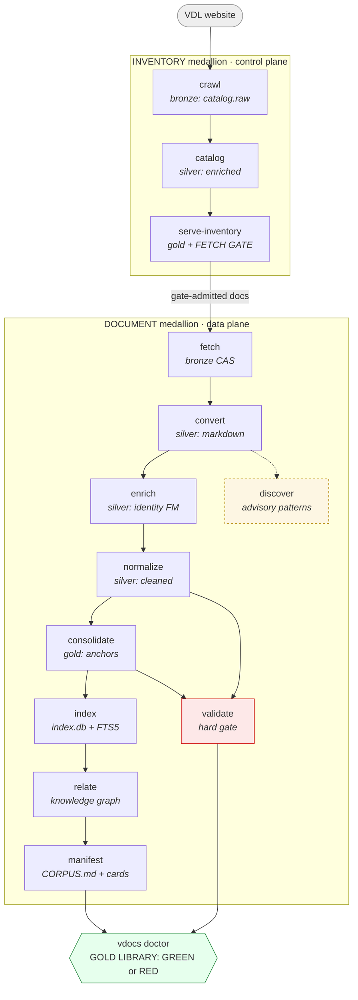

# vdocs — User Guide

```
            _
 __   ____| | ___   ___ ___
 \ \ / / _` |/ _ \ / __/ __|     VistA Document Library → clean markdown corpus
  \ V / (_| | (_) | (__\__ \     + an offline, zero-ML lexical search index
   \_/ \__,_|\___/ \___|___/     gate · build · doctor
```

`vdocs` turns the **VA VistA Document Library** (VDL — thousands of DOCX/PDF manuals) into a clean,
human-browsable **markdown corpus** *and* a self-contained **lexical search index** (`index.db`,
SQLite + FTS5) that any developer can search **offline, with zero ML dependencies**. The repo, the
import package, and the CLI are all named `vdocs`.

> **Lexical-first & offline.** An earlier semantic/vector + MCP surface was descoped. vdocs is now a
> lexical (FTS5) + structured (facets) + graph (entity relations) search tool over a gold markdown
> corpus — no embeddings, no GPU, nothing to vendor on an airgapped box.

---

## Table of contents

1. [Quick start](#1-quick-start)
2. [What vdocs gives you](#2-what-vdocs-gives-you)
3. [The pipeline at a glance](#3-the-pipeline-at-a-glance)
4. [Pipeline flow (mermaid)](#4-pipeline-flow-mermaid)
5. [The medallion data lake](#5-the-medallion-data-lake)
6. [Stage-by-stage reference](#6-stage-by-stage-reference)
7. [CLI command reference](#7-cli-command-reference)
8. [The admission gate (what enters the corpus)](#8-the-admission-gate-what-enters-the-corpus)
9. [Configuration & registries](#9-configuration--registries)
10. [Reading run output: GREEN / WARN / ERROR](#10-reading-run-output-green--warn--error)
11. [Trusting the corpus: `vdocs doctor`](#11-trusting-the-corpus-vdocs-doctor)
12. [Searching the corpus: `vdocs ask`](#12-searching-the-corpus-vdocs-ask)
13. [Airgapped operation](#13-airgapped-operation)
14. [Troubleshooting](#14-troubleshooting)
15. [Further reading](#15-further-reading)

---

## 1. Quick start

The whole build is **three commands**:

```bash
vdocs gate                 # 1. PREVIEW — see exactly what will be fetched/promoted (no run, no network)
vdocs build --fresh --yes  # 2. BUILD   — crawl → … → manifest → doctor, one orchestrated command
vdocs doctor               # 3. TRUST   — re-check the corpus → GOLD LIBRARY: GREEN|RED
```

`vdocs build` already runs `doctor` at the end; step 3 is for re-checking later. The build needs
**network** (for `crawl` + `fetch`); everything after `fetch` runs offline.

Then search:

```bash
vdocs ask "how to add a new patient" --k 8
```

Configuration lives in `~/.env` / env vars (notably `DATA_DIR`, default `~/data/vdocs`) and the
version-controlled `registries/` in the repo.

---

## 2. What vdocs gives you

| Capability | How |
|---|---|
| **A clean markdown corpus** | One gold anchor document per logical manual, version-collapsed, with title-page/revision/TOC artifacts stripped and a regenerated `## Contents`. |
| **Offline lexical search** | `index.db` (SQLite + FTS5) over the latest searchable chunks — `vdocs ask "<question>"` returns ranked, **pre-cited** hits with stable IDs. |
| **Faceted / structured search** | Documents carry persona + identity facets (`app_user`, `doc_user`, `software_class`, `function_category`, `doc_type`, …) for narrow-by-facet queries. |
| **A knowledge graph** | Extracted VistA entities (routines, globals, RPCs, options, FileMan files, builds, …) + doc↔entity / entity↔entity / doc↔doc relations. |
| **An AI corpus card** | `CORPUS.md` + `ai-manifest.json` — a self-describing front door for agents (the "answer from THIS corpus" recipe). |
| **A shipped soundness gate** | `vdocs doctor` → `GOLD LIBRARY: GREEN|RED`, separating by-design gaps from real defects. |
| **A legible, self-narrating pipeline** | Per-stage banners, live `GREEN/WARN/ERROR` status, progress heartbeats, an end-of-run summary table, and a documented exit-code contract. |

---

## 3. The pipeline at a glance

vdocs is a **17-section design** realized as a **13-stage DAG** over a **medallion lake**
(bronze → silver → gold), driven by a generic in-house orchestrator. Two medallions run side by side:

```
        ┌──────────────────────────── INVENTORY medallion (control plane) ───────────────────────────┐
 VDL ──▶ crawl ──▶ catalog ──▶ serve-inventory ──▶ [ THE FETCH GATE ]
        │ bronze    silver          gold (selection surface)                                          │
        └──────────────────────────────────────────────┬───────────────────────────────────────────-─┘
                                                        │ (gate-admitted documents)
        ┌───────────────────────────── DOCUMENT medallion (data plane) ────────────────-──────────────┐
        ▼
      fetch ──▶ convert ──▶ enrich ──▶ normalize ──▶ consolidate ──▶ index ──▶ relate ──▶ manifest
      bronze    silver       silver      silver         gold          derived   graph      gold/agent
      (CAS)    (markdown)   (identity)  (cleaned)     (anchors)      (index.db)            (CORPUS.md)
                  │                                                      │
              discover                                                validate
            (advisory patterns)                                     (hard gate)
        └────────────────────────────────────────────────────────────────────────────────────────────┘
                                                        │
                                                        ▼
                                                  vdocs doctor  →  GOLD LIBRARY: GREEN|RED
```

- **`discover`** is an advisory side-branch: it mines candidate patterns and proposes registry
  updates; it mutates nothing.
- **`validate`** is a hard gate near the end (sidecar verification + integrity); it always re-runs.

---

## 4. Pipeline flow (mermaid)



---

## 5. The medallion data lake

Data lives under `$DATA_DIR` (default `~/data/vdocs`) — **never in the repo**. The curated
`registries/` are version-controlled **in the repo**.

```
~/data/vdocs/                              # $DATA_DIR
├── inventory/                             # INVENTORY medallion (control plane)
│   ├── bronze/catalog.raw.json            #   crawl: the raw scraped catalog
│   ├── silver/catalog.enriched.json       #   catalog: conformed per-record inventory
│   └── gold/inventory.{json,csv,db}       #   serve-inventory: selection surface + the fetch gate
├── documents/                             # DOCUMENT medallion (data plane)
│   ├── bronze/raw/<sha256>.docx           #   fetch: content-addressed downloads (+ raw/index.json)
│   ├── assets/<sha256>.<ext>              #   convert: shared image CAS
│   ├── silver/text/01-converted/…         #   convert: raw markdown bundles
│   ├── silver/text/02-enriched/…          #   enrich: + identity frontmatter
│   ├── silver/text/03-normalized/…        #   normalize: cleaned, gold-quality bodies
│   └── gold/                              #   consolidate + manifest
│       ├── consolidated/<app>/<slug>/…    #     one anchor document per logical manual
│       ├── _shared/{history,boilerplate}  #     retained prior bodies + canonical blocks
│       ├── corpus-manifest.json           #     corpus schema/counts/capabilities
│       ├── discovery.json                 #     machine discovery descriptor
│       ├── ai-manifest.json · CORPUS.md   #     the AI corpus card
│       └── glossary.md
├── state.db                               # orchestrator state: stage runs + acquisitions
├── index.db                               # the search surface (documents/sections/chunks+FTS5/entities/relations)
└── reports/                               # survey · headings · lexicon · patterns · validation · run logs
```

---

## 6. Stage-by-stage reference

The DAG has **13 stages**. Order is derived from each stage's declared inputs/outputs (a topological
sort), so you never maintain an ordered list by hand. The table is in execution order.

| # | Stage | Track | What it does | Reads → Writes | Re-run policy |
|---|---|---|---|---|---|
| 1 | **crawl** | inventory · bronze | Walks the VDL site (index → sections → applications) into the raw catalog. *Network.* | VDL → `catalog.raw.json` | `FORCE_ONLY` (always runs when invoked) |
| 2 | **catalog** | inventory · silver | Enriches the raw catalog into the conformed inventory: identity (app/patch/version), doc-type classification, noise tagging, version grouping. *Deterministic.* | `catalog.raw` → `catalog.enriched` | skip-if-unchanged |
| 3 | **serve-inventory** | inventory · gold | Promotes the enriched inventory to the gold **selection surface** (JSON/CSV/SQLite) and blesses **the fetch gate**. | `catalog.enriched` → `inventory.{json,csv,db}` | skip-if-unchanged |
| 4 | **fetch** | document · bronze | Downloads the **selected, gate-admitted** documents (DOCX only) into a content-addressed store. Idempotent resume; classifies persistent failures. *Network.* | gold inventory → `bronze/raw/` (CAS) + `raw/index.json` | skip-if-unchanged |
| 5 | **convert** | document · silver | Converts each fetched DOCX to a markdown bundle (Pandoc, or Docling for an allowlist) + extracts images to the shared asset CAS. | `bronze/raw` → `silver/01-converted` + `assets` | skip-if-unchanged |
| 6 | **discover** | document · advisory | Mines candidate **boilerplate / dead-phrase / glossary / structure / template** patterns — *proposals only, mutates nothing* (discovery-is-data). | converted + `catalog.enriched` → `reports/patterns` | skip-if-unchanged |
| 7 | **enrich** | document · silver | Bakes **identity frontmatter** (app, title, version, personas) onto each bundle and stages doc metadata for the index. | converted + `catalog.enriched` → `silver/02-enriched` + staged meta | skip-if-unchanged |
| 8 | **normalize** | document · silver | Produces gold-quality bodies: strips title-page/revision/TOC artifacts (capture-before-strip), subtracts dead phrases, lifts tables to CSV sidecars, regenerates `## Contents`. | enriched + registries → `silver/03-normalized` | skip-if-unchanged |
| 9 | **consolidate** | document · gold | Collapses each version group to **one anchor document** at a stable path (latest body) + captures the append-only lineage (`history.yaml` + retained prior bodies). | normalized + assets → `gold/consolidated` | skip-if-unchanged |
| 10 | **index** | derived | Builds `index.db`: `documents` (+ persona/facet columns), `doc_sections`, `chunks` + **FTS5** over the latest searchable chunks, and `entities`. | normalized + consolidated + staged meta → `index.db` tables | skip-if-unchanged |
| 11 | **validate** | document · gate | **Hard gate**: typed-absence reconciliation, count drop check, ref resolution (severed cross-refs), and bundle-integrity (tamper) verification. | normalized + consolidated → `reports/validation` | `ALWAYS_RERUN` |
| 12 | **relate** | derived · graph | Materializes the knowledge graph (doc↔entity, entity↔entity, doc↔doc) into `relations`. | index documents/entities/sections → `index.db:relations` | skip-if-unchanged |
| 13 | **manifest** | document · gold/agent | Assembles `corpus-manifest.json` + `discovery.json` + the AI corpus card (`ai-manifest.json` / `CORPUS.md`) + the promoted glossary. | consolidated + index + relations + registries → gold cards | skip-if-unchanged |

**Re-run policies** (the orchestrator's `Idempotency`):
- `skip-if-unchanged` — re-runs only when an input fingerprint, the contract version, or (for `fetch`)
  the selection/gate changed. A clean re-run is a no-op.
- `FORCE_ONLY` — never runs as part of a slice unless explicitly invoked/forced (e.g. `crawl`).
- `ALWAYS_RERUN` — re-runs every time (e.g. `validate`, the gate).

Every stage shares one generic `preflight → run → postflight` path: preflight checks inputs +
upstream completion + the skip decision; postflight validates outputs + runs the stage's deep gate
before recording success. Per-document stages (`convert`/`normalize`/`consolidate`) **isolate** a
single bad document (WARN + count + continue) but fail if the failure *rate* is systemic.

---

## 7. CLI command reference

Every command drives the **same orchestrator** (there is no second execution route). Per-stage
commands take `--force/-f`. Run `vdocs <command> --help` for the in-tool guide.

### Orchestration

| Command | What it does | Key options |
|---|---|---|
| `vdocs build` | **Guided from-scratch build**: crawl → … → manifest → doctor, one command. | `--fresh` (wipe derived lake first), `--yes` (confirm the destructive wipe — required), `--skip-crawl` (reuse `catalog.raw.json`) |
| `vdocs run` | Run the DAG, or a slice, through the orchestrator. | `--from <stage>`, `--to <stage>`, `--only <stage>`, `--force/-f`, `--verify` (strong content-hash fingerprints), `--strict` (exit 10 if any WARN) |

### Per-stage commands

| Command | Options |
|---|---|
| `vdocs crawl` | *(none — FORCE_ONLY, always runs; network)* |
| `vdocs catalog` | `--force/-f` |
| `vdocs serve-inventory` | `--force/-f` |
| `vdocs fetch` | `--app`, `--section`, `--status`, `--doc-type`, `--group` (selection filters; AND across, OR within), `--select <file>` (curated doc-id list), `--all` (whole gated inventory), `--dry-run` (report match count, fetch nothing), `--refetch` (re-download even CAS-present docs), `--force/-f` |
| `vdocs convert` · `discover` · `enrich` · `normalize` · `consolidate` · `index` · `relate` · `manifest` · `validate` | `--force/-f` |

### Inspect / search / verify

| Command | What it does | Options |
|---|---|---|
| `vdocs gate` | Explain the **admission gate** (kept/omitted doc-types, app scope, untyped fail-safe) + admitted-vs-excluded counts. | `--counts/--no-counts` |
| `vdocs inventory` | Inspect the gold inventory; `--status` joins fetch status per document. | `--status` |
| `vdocs ask` | Search the gold corpus → ranked, **pre-cited** hits. | `<query>` (arg), `--k/-k <n>`, `--app`, `--doc-type`, `--json` |
| `vdocs doctor` | The shipped soundness gate → `GOLD LIBRARY: GREEN\|RED` (exit 1 on RED). | *(none)* |

> **Selection model (`fetch`).** There is **no blind download**: with no selection, `fetch` fetches
> nothing and reports how many genuine in-scope documents are available. Narrow with the dimension
> filters, or take everything with `--all`. The always-on admission gate + DOCX-only scope apply
> regardless of the selection.

---

## 8. The admission gate (what enters the corpus)

A document is admitted only if it survives **four narrowings** (the first two at `catalog`, the last
two are the operator-tunable `GatePolicy`). What's fetched == what reaches gold (`consolidate` only
dedups versions, it never re-admits).

| # | Narrowing | Driven by | Drops |
|---|---|---|---|
| 1 | Noise gate | `registries/inventory/noise-domains.yaml` | site chrome, forms (non-documents) |
| 2 | DOCX-only scope | the pipeline | non-DOCX representations (PDF-only docs yield no target) |
| 3 | App scope | `registries/inventory/scope-policy.yaml` | apps whose `system_type` lacks an allowed prefix, or whose status is denied |
| 4 | Doc-type policy | `registries/inventory/doctype-policy.yaml` | doc-types marked `decision: omit` (Tiers B/C/D); **untyped → kept (fail-safe)** |

**Preview it before you run:** `vdocs gate`. **Change it:** edit the YAML, re-preview, re-run from
`serve-inventory`. Full detail in [`gate-reference.md`](gate-reference.md).

---

## 9. Configuration & registries

Configuration is a single typed `Settings` object (Pydantic Settings), env-overridable; **no
hardcoded paths**.

| Setting | Env var | Default |
|---|---|---|
| Data lake root | `DATA_DIR` / `VDOCS_DATA_DIR` | `~/data/vdocs` |
| VDL base URL | `VDL_BASE_URL` | `https://www.va.gov/vdl/` |
| Crawl politeness delay | `CRAWL_DELAY` | `1.5` (seconds) |
| Registries dir | `REGISTRIES_DIR` | `<repo>/registries` |

The curated **`registries/`** (version-controlled in the repo — *discovery is data, not code*):

| Registry | Purpose |
|---|---|
| `inventory/scope-policy.yaml` | app-scope gate (allowed system-types, denied statuses) |
| `inventory/doctype-policy.yaml` | doc-type keep/omit policy (+ the untyped fail-safe) |
| `inventory/noise-domains.yaml` | noise/chrome tagging |
| `inventory/doc-types.yaml`, `doc-labels.yaml`, `app-profiles.yaml`, … | doc-type/label classification + app persona profiles |
| `boilerplate/`, `phrases/`, `glossary/`, `structures/`, `templates/` | normalization vocabularies (curated patterns `discover` proposes against) |
| `converter-routing/` | which bundles convert with Docling vs Pandoc |
| `doctor-policy.yaml` | `doctor` coverage floors + by-design notes + accepted edge cases |
| `golden-queries.yaml`, `dev-corpus.txt` | search-quality baseline + dev selection list |

---

## 10. Reading run output: GREEN / WARN / ERROR

Every run narrates itself: a `[k/N] stage — description` banner, progress heartbeats for long stages,
a live result line, and an end-of-run **summary table** + verdict.

| Status | Meaning | Blocks? |
|---|---|---|
| `GREEN` | the stage did its work, no caveats | no |
| `WARN` | completed, but look — e.g. some docs are permanently unavailable upstream, or a doc was isolated after failing to convert | **no** |
| `ERROR` | a preflight/postflight gate failed; the run stopped here | **yes** |

**Exit-code contract:** `0` = all GREEN (or WARN, by default) · `1` = an ERROR stopped the run (or
`doctor` is RED) · `10` = `vdocs run --strict` with WARNs (opt-in, lets CI treat WARNs as failures).

Example tail of a build:

```
═══ vdocs run summary ═══════════════════════════════════════════════
  #  stage         status   counts                       warn  elapsed
  1  crawl         GREEN    docs=8907 apps=396              0    42.1s
  4  fetch         WARN     fetched=1040 permanent=2        2     6m12s
 13  manifest      GREEN    gold_docs=615                   0     3.2s
─────────────────────────────────────────────────────────────────────
  VERDICT: WARN (12 GREEN, 1 WARN, 0 ERROR)
```

Output is **Rich** on a real terminal (colored banners + a boxed table) and degrades to plain text
on a pipe / CI / non-TTY.

---

## 11. Trusting the corpus: `vdocs doctor`

`vdocs doctor` reads `index.db` and answers "is my gold corpus sound?" with a check table and a final
**`GOLD LIBRARY: GREEN|RED`**. Each check is bucketed:

| Bucket | Meaning |
|---|---|
| `PASS` | the check holds |
| `BY-DESIGN` | an expected gap, not a defect (e.g. `function_category` is empty for fallback-profile apps) — encoded in `doctor-policy.yaml` |
| `WARN` | worth a look but not corrupting (e.g. an accepted anchor edge case, or an untyped gold doc awaiting triage) |
| `FAIL` | a real defect — **any FAIL ⇒ RED** |

Checks include: persona + identity **coverage** (vs policy floors), **anchor integrity** (one latest
per anchor), **gate fidelity** (only Tier-A doc-types in gold), the **FTS search surface**, and the
**entity graph**. `doctor` exits 1 on RED — it is the authoritative gate (it replaces a manual
sign-off).

---

## 12. Searching the corpus: `vdocs ask`

```bash
vdocs ask "kernel sign-on" --k 8                 # ranked, pre-cited hits
vdocs ask "pharmacy order" --app PSO --doc-type UM
vdocs ask "how to add a new patient" --json      # machine-readable for tools/agents
```

Each hit is **pre-cited**: a stable `section_id` / `doc_key`, the document + section titles, a
snippet, a relevance score, and the resolved gold `body.md` path — so an answer can cite the corpus
without guessing. Lexical FTS5 over the latest searchable chunks; restrict with `--app` / `--doc-type`.

For agents, the gold `CORPUS.md` / `ai-manifest.json` describe the corpus and the "answer from THIS
corpus" query recipe.

---

## 13. Airgapped operation

`fetch` is the only step past `crawl` that needs the network. To build offline:

1. **Connected box:** `vdocs crawl && vdocs catalog && vdocs serve-inventory && vdocs fetch --all`
   (downloads every gate-admitted document into the bronze CAS).
2. **Copy the lake** (`~/data/vdocs` — at minimum `documents/bronze/`, `inventory/`, `state.db`) to the
   airgapped box.
3. **Airgapped box (offline):** `vdocs run --from convert --to manifest && vdocs doctor`.

Everything from `convert` onward is pure local computation — no network, no ML, nothing to vendor.

---

## 14. Troubleshooting

| Symptom | What it means / what to do |
|---|---|
| "another vdocs process appears to be active" | The shared-lake guard fired — another pipeline is running (two orchestrators race the lake). Wait; check `reports/*.log`. |
| `fetch` reports `permanent_missing` docs | A few VDL docs return persistent HTTP 500/404. After the attempt cap they're marked permanent and **no longer retried** — an upstream gap, not a defect. The run proceeds (WARN). |
| Re-running `fetch` seems slow | It shouldn't re-download — already-fetched docs are CAS hits (skipped). Use `vdocs fetch --all --force` to retry only failures; `--refetch` forces a full re-download. |
| `catalog` fails: "upstream crawl has not completed ok" | Shouldn't happen anymore — `catalog` runs off `catalog.raw.json` even without a crawl record. If `catalog.raw.json` is missing, run `vdocs crawl`. |
| `vdocs doctor` is RED | Read the `FAIL` rows — they name the offending docs (e.g. untyped gold docs, over-marked anchors, forbidden doc-types). Fix the cause (often a registry/classification gap) and rebuild. |
| A stage shows ERROR with a traceback-free message | That's by design — preflight/postflight failures render a clean ERROR line + remediation, never a raw traceback. Follow the `→ remediation` hint. |
| Lake got cluttered / a build half-finished | `vdocs build --fresh --yes` wipes the derived lake (incl. `state.db`, so `fetch` re-downloads) and rebuilds from scratch. |

---

## 15. Further reading

- **[`de-novo-run.md`](de-novo-run.md)** — the operator runbook (the canonical three-command build).
- **[`gate-reference.md`](gate-reference.md)** — the admission gate, in depth.
- **[`offline-lexical-search-plan.md`](offline-lexical-search-plan.md)** — the active project plan
  (what/why) and its implementation tracker (how/status).
- **[`doc-classification-filtering-summary.md`](doc-classification-filtering-summary.md)** — the
  facet/doc-type taxonomy reference.
- **[`pipeline-operability-hardening-findings.md`](pipeline-operability-hardening-findings.md)** — the
  review + design behind the current operator-facing UX.
- `vdocs <command> --help` — the in-tool reference for any command.
